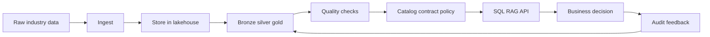
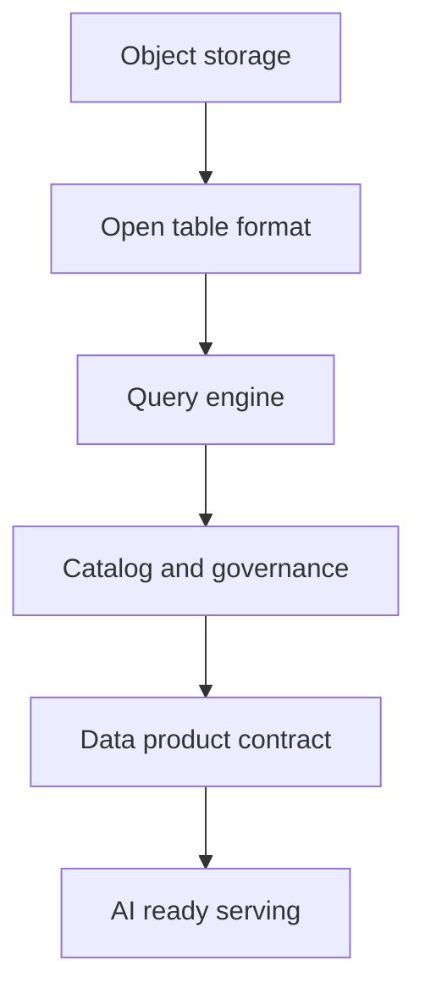
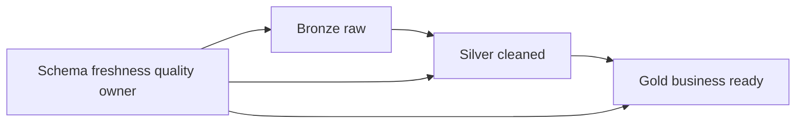
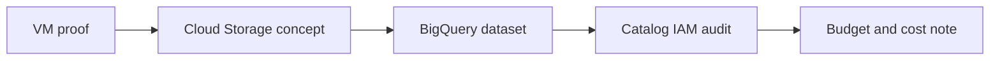
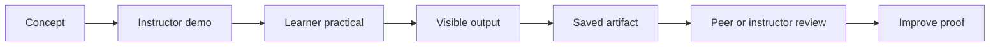
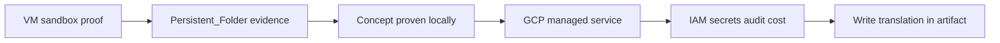

# Day 1 - The Modern Data Foundation And The Agentic Data Value Chain - Learner Revision, Diagrams And Study Pack

Share this Markdown with learners after class. It is written for revision, redraw practice and hands-on follow-up. It does not include private lab credentials, URLs, tokens or screenshots.

## 1. Today In One Paragraph

Today focused on **lakehouse, open formats, catalog, data products, contracts, cost**. The main idea is to move from tool usage to visible evidence: dataset, business decision, practical proof, risk, control, GCP translation and a saved artifact that another person can review.

**Memory line:** Correct answer with unauthorized or unmanaged data is still failure.

## 2. Course Syllabus Outcomes Covered

- Explain the modern lakehouse: object storage plus open table format plus query engine plus catalog.
- Map ingest, store, transform, quality, govern, serve, consume and audit.
- Create a data-product spec and data contract for the insurance lane.
- Explain storage choices, partitioning, clustering, schema evolution, catalog ownership, ingestion patterns, modelling and FinOps.

## 3. Dataset, Tools And Saved Evidence

| Item | What to remember |
|---|---|
| Demo lane | `Insurance` |
| Primary dataset | `Insurance/Insurance/insurance policy data.xlsx` |
| Fallback dataset | `Retail/salesamp Retail/Sample - Superstore.xls` |
| VM evidence folder | `Persistent_Folder/day-01-evidence` |
| Main Markdown artifact | `day-01-insurance-data-product-spec.md` |
| Notebook/proof file | `day-01-profile-insurance-policy.ipynb` |
| GCP translation | Cloud Storage landing bucket concept, BigQuery dataset/table, IAM, audit, cost controls |
| AI assistants | Codex or Claude Code may draft, explain or inspect. Learners must review before accepting. |

## 4. Practical Steps Learners Should Be Able To Repeat

1. Open the insurance dataset and create a small visible profile proof.
2. Write a one-page data-product spec with dataset, decision, owner, consumers and risk.
3. Add a data contract: schema, freshness, quality SLA, access and change rule.
4. Map the local proof to Cloud Storage, BigQuery, IAM, catalog/audit and cost controls.
5. Save the artifact, write one limitation honestly, and be ready to explain what evidence proves the work.

## 5. Live-Class Flow Recap

| Time | What happened | Revision task |
|---|---|---|
| 11:00-11:30 | Greeting, Icebreaker And Expectations | Explain the evidence or decision produced in this segment. |
| 11:30-11:55 | Mini Lecture 1: Simple Concept Before Tool | Write the concept in your own words. |
| 11:55-12:20 | Mini Lecture 2: Course Syllabus Topics In Plain English | Write the concept in your own words. |
| 12:20-12:50 | Practical 1: Create Evidence Trail | Repeat the step or inspect the saved artifact. |
| 12:50-13:20 | Practical 2: Open Dataset And Create Smallest Visible Proof | Repeat the step or inspect the saved artifact. |
| 13:20-13:50 | Practical 3: Use Codex Or Claude Code Safely | Repeat the step or inspect the saved artifact. |
| 13:50-14:30 | Practical 4: Build The Main Day Artifact | Repeat the step or inspect the saved artifact. |
| 14:30-14:50 | Misconceptions And Real-World Example | Explain the evidence or decision produced in this segment. |
| 16:00-16:20 | Restart From Saved Proof | Explain the evidence or decision produced in this segment. |
| 16:20-17:05 | GCP Translation Practical | Repeat the step or inspect the saved artifact. |
| 17:05-17:45 | Learner Build And Instructor Rounds | Repeat the step or inspect the saved artifact. |
| 17:45-18:20 | Peer Review | Check that the artifact is defensible and complete. |
| 18:20-18:55 | Aha Moment And Syllabus Coverage Check | Explain the evidence or decision produced in this segment. |
| 18:55-19:20 | Ship Review And Exit Ticket | Check that the artifact is defensible and complete. |
| 19:20-19:30 | Homework And Close | Check that the artifact is defensible and complete. |

## 6. Key Concepts In Simple Words

| Concept | Simple meaning |
|---|---|
| Lakehouse | Object storage plus open table format plus query engine plus catalog. |
| Open table format | Delta/Iceberg/Hudi style table metadata that avoids treating files as unmanaged junk drawers. |
| Catalog control plane | The place where ownership, meaning, access, lineage, tags and discovery are controlled. |
| Data product | A dataset with an owner, consumer, business decision, contract, quality promise and evidence. |
| Data contract | A producer-consumer promise about schema, freshness, quality, ownership and change handling. |
| Artifact | A saved proof file that another person can inspect later. |
| Evidence | A visible output such as a query result, row count, test result, log, screenshot note, or reviewed markdown. |
| Control before trust | A check, approval, policy or audit record that must exist before a data or AI output is trusted. |
| Trust boundary | The line between what an AI/tool may suggest and what a human or governed platform may approve or execute. |
| GCP translation | The cloud-managed equivalent of what was first proved in the VM sandbox. |

## 7. Diagrams To Redraw And Revise

Redraw these diagrams by hand or in Mermaid. For each arrow, say what responsibility moves from one box to the next and what evidence proves the step.

### Diagram 1: Data Value Chain With Agent Opportunities

Revision prompt: explain each box, then name one risk and one control for this flow.

### Diagram 2: Lakehouse Decision Stack

Revision prompt: explain each box, then name one risk and one control for this flow.

### Diagram 3: Medallion And Contract

Revision prompt: explain each box, then name one risk and one control for this flow.

### Diagram 4: Platform Mapping

Revision prompt: explain each box, then name one risk and one control for this flow.

### Diagram 5: Evidence Loop Used Every Day

Revision prompt: explain each box, then name one risk and one control for this flow.

### Diagram 6: VM To GCP Translation Map

Revision prompt: explain each box, then name one risk and one control for this flow.

## 8. Revision Notes And Checks

- Do not say a tool was used unless you can point to evidence.
- Do not trust AI output until the source, permission, test result or approval is visible.
- Do not include secrets, tokens, private URLs or credentials in shared artifacts.
- For every practical, be able to answer: what data, what output, what risk, what control, what limitation?
- For every GCP translation, be able to say what the VM proved and what the managed service would own in production.

## 9. Self-Quiz

| # | Question | Expected answer shape |
|---:|---|---|
| 1 | What is the main artifact for today? | Name the exact `.md` file and evidence folder. |
| 2 | What business decision does the artifact support? | Say the decision and why wrong data would hurt it. |
| 3 | What is the strongest proof you saved? | Name a row count, output, diagram, test, log, decision or review. |
| 4 | What is the main trust boundary? | Say what AI/tool may suggest and what needs platform or human control. |
| 5 | What is the GCP translation? | Name the GCP services and their responsibility. |

## 10. Practice Before The Next Class

Spend 20-30 minutes improving the saved artifact:

1. Add one stronger proof line.
2. Add or redraw one Mermaid diagram from this pack.
3. Add one clearer risk and one control before trust.
4. Add one honest limitation: what the class demo does not prove yet.
5. Add one question to bring to the next class.

## 11. Shareable Checklist

- [ ] My artifact is saved in the persistent folder.
- [ ] My artifact names the dataset or fallback dataset.
- [ ] My artifact includes the business decision.
- [ ] My artifact includes at least one visible proof.
- [ ] My artifact includes at least one risk and one control.
- [ ] My artifact includes the GCP translation.
- [ ] My artifact does not expose secrets or private lab access.
- [ ] I can explain at least two diagrams without reading the full script.

## 12. Further Study Links

Use these for follow-up reading. Prefer official documentation when tool behavior matters.

- [BigQuery quickstart: load and query data in the console](https://docs.cloud.google.com/bigquery/docs/quickstarts/load-data-console)
- [Run BigQuery queries](https://docs.cloud.google.com/bigquery/docs/running-queries)
- [BigQuery partitioned tables](https://docs.cloud.google.com/bigquery/docs/partitioned-tables)
- [BigQuery clustering](https://docs.cloud.google.com/bigquery/docs/clustering-overview)
- [BigQuery time travel and historical data](https://docs.cloud.google.com/bigquery/docs/time-travel)
- [Cloud Storage buckets](https://docs.cloud.google.com/storage/docs/creating-buckets)
- [Secret Manager overview](https://docs.cloud.google.com/secret-manager/docs/overview)
- [Cloud Run deploy from source](https://docs.cloud.google.com/run/docs/deploying-source-code)
- [Cloud Functions concepts](https://docs.cloud.google.com/functions/docs/concepts/overview)
- [Firestore overview](https://docs.cloud.google.com/firestore/docs/overview)
- [Pub/Sub overview](https://docs.cloud.google.com/pubsub/docs/overview)
- [Apache Airflow DAGs](https://airflow.apache.org/docs/apache-airflow/stable/core-concepts/dags.html)
- [Apache Airflow REST API](https://airflow.apache.org/docs/apache-airflow/2.10.4/stable-rest-api-ref.html)
- [dbt data tests](https://docs.getdbt.com/docs/build/data-tests)
- [BigQuery documentation](https://docs.cloud.google.com/bigquery/docs)
- [Vertex AI RAG Engine](https://cloud.google.com/vertex-ai/generative-ai/docs/rag-engine/rag-overview)
- [Model Context Protocol tools](https://modelcontextprotocol.io/specification/2025-06-18/server/tools)

## 13. Bridge To The Next Day

Tomorrow should not restart from zero. Bring forward today's saved artifact, strongest proof, weakest risk/control, and one question. The next class builds on this evidence.
