# Day 2 - Agentic Data Engineering And Pipelines - Learner Revision, Diagrams And Study Pack

Share this Markdown with learners after class. It is written for revision, redraw practice and hands-on follow-up. It does not include private lab credentials, URLs, tokens or screenshots.

## 1. Today In One Paragraph

Today focused on **dbt, orchestration, CDC, self-healing, memory, human approval**. The main idea is to move from tool usage to visible evidence: dataset, business decision, practical proof, risk, control, GCP translation and a saved artifact that another person can review.

**Memory line:** Signal is not diagnosis. A failed row count tells you something changed; it does not tell you what to repair.

## 2. Course Syllabus Outcomes Covered

- Build an ELT pipeline with model, test and run log.
- Explain orchestration with Airflow/Dagster/Prefect style DAG thinking.
- Use AI to draft pipeline code safely, then inspect and correct it.
- Simulate schema drift and write a monitor-diagnose-fix decision log.

## 3. Dataset, Tools And Saved Evidence

| Item | What to remember |
|---|---|
| Demo lane | `Insurance` |
| Primary dataset | `Insurance/Insurance Claims and Policy Data/Insurance Claims and Policy Data.zip` |
| Fallback dataset | `Insurance/Insurance/insurance_cash_application.csv` |
| VM evidence folder | `Persistent_Folder/day-02-evidence` |
| Main Markdown artifact | `day-02-insurance-pipeline-run-log.md` |
| Notebook/proof file | `day-02-bronze-silver-gold-pipeline.ipynb` |
| GCP translation | BigQuery transformation pipeline, Cloud Functions trigger concept, Airflow/Composer concept, Secret Manager for credentials |
| AI assistants | Codex or Claude Code may draft, explain or inspect. Learners must review before accepting. |

## 4. Practical Steps Learners Should Be Able To Repeat

1. Open the insurance claims pipeline artifact and VM notebook.
2. Create bronze, silver and gold proof or a run-summary table.
3. Simulate schema drift and separate signal from diagnosis.
4. Design a Claude-powered monitor that proposes a patch but does not approve it.
5. Map Airflow REST, dbt, schema registry, BigQuery, Secret Manager, MCP/tool runner and vector memory.
6. Save the artifact, write one limitation honestly, and be ready to explain what evidence proves the work.

## 5. Live-Class Flow Recap

| Time | What happened | Revision task |
|---|---|---|
| 11:00-11:10 | Fast Start And Recall | Explain the evidence or decision produced in this segment. |
| 11:10-11:35 | Mini Lecture 1: Simple Concept Before Tool | Write the concept in your own words. |
| 11:35-12:05 | Mini Lecture 2: Course Syllabus Topics In Plain English | Write the concept in your own words. |
| 12:05-12:35 | Practical 1: Create Evidence Trail | Repeat the step or inspect the saved artifact. |
| 12:35-13:05 | Practical 2: Open Dataset And Create Smallest Visible Proof | Repeat the step or inspect the saved artifact. |
| 13:05-13:35 | Practical 3: Use Codex Or Claude Code Safely | Repeat the step or inspect the saved artifact. |
| 13:35-14:20 | Practical 4: Build The Main Day Artifact | Repeat the step or inspect the saved artifact. |
| 14:20-14:45 | Misconceptions And Real-World Example | Explain the evidence or decision produced in this segment. |
| 16:00-16:15 | Restart From Saved Proof And Re-Anchor | Explain the evidence or decision produced in this segment. |
| 16:15-16:35 | Lab 5: Harden The VM Pipeline Proof | Repeat the step or inspect the saved artifact. |
| 16:35-17:05 | GCP Translation Lab A: BigQuery Pipeline Mapping | Repeat the step or inspect the saved artifact. |
| 17:05-17:30 | GCP Translation Lab B: Cloud Functions Trigger Concept | Repeat the step or inspect the saved artifact. |
| 17:30-17:50 | GCP Translation Lab C: Secret Manager And Cloud Composer | Repeat the step or inspect the saved artifact. |
| 17:50-18:10 | Mini Lecture 4: Claude For Data Engineering And Tool Calling | Write the concept in your own words. |
| 18:10-18:35 | Practical 6: Build The H1 Insurance Claude-Powered Pipeline Agent Design | Repeat the step or inspect the saved artifact. |
| 18:35-18:55 | Pipeline Memory, Guardrails, Legacy Compatibility And Coverage Check | Explain the evidence or decision produced in this segment. |
| 18:55-19:15 | Ship Review And Peer Review | Check that the artifact is defensible and complete. |
| 19:15-19:30 | Feedback, Homework And Close | Check that the artifact is defensible and complete. |

## 6. Key Concepts In Simple Words

| Concept | Simple meaning |
|---|---|
| Agentic pipeline | A pipeline with monitor, diagnose, propose, approve, execute and learn steps around it. |
| Signal versus diagnosis | A signal says something may be wrong; diagnosis explains why using evidence. |
| Claude for data engineering | Claude Code can draft code; Claude apps can diagnose from structured evidence; tool calling lets an app execute controlled functions. |
| Keep model out of data path | Raw data stays in the platform; the model receives small evidence and proposes changes. |
| Pipeline memory | A vector/searchable store of failures, fixes, decisions and evidence for future incidents. |
| Guardrails for autonomy | Read-only by default, approvals for risky writes, decision logs, idempotent and reversible operations. |
| Legacy compatibility | Agents should wrap existing Airflow DAGs, Spark jobs and dbt models without forcing a rebuild. |
| Artifact | A saved proof file that another person can inspect later. |
| Evidence | A visible output such as a query result, row count, test result, log, screenshot note, or reviewed markdown. |
| Control before trust | A check, approval, policy or audit record that must exist before a data or AI output is trusted. |
| Trust boundary | The line between what an AI/tool may suggest and what a human or governed platform may approve or execute. |
| GCP translation | The cloud-managed equivalent of what was first proved in the VM sandbox. |

## 7. Diagrams To Redraw And Revise

Redraw these diagrams by hand or in Mermaid. For each arrow, say what responsibility moves from one box to the next and what evidence proves the step.

### Diagram 1: Agentic Pipeline Loop

Revision prompt: explain each box, then name one risk and one control for this flow.

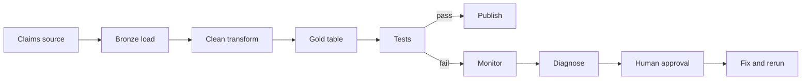

### Diagram 2: Signal Versus Diagnosis

Revision prompt: explain each box, then name one risk and one control for this flow.

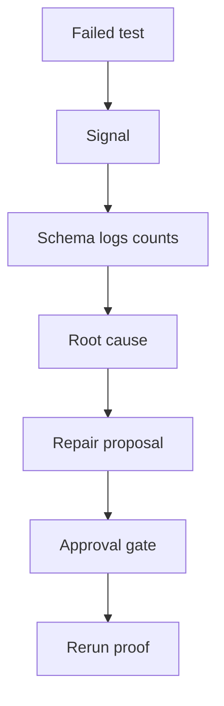

### Diagram 3: Keep Model Out Of Data Path

Revision prompt: explain each box, then name one risk and one control for this flow.

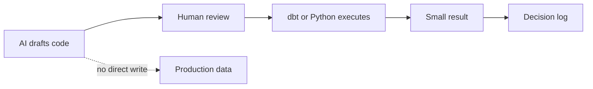

### Diagram 4: Pipeline Memory

Revision prompt: explain each box, then name one risk and one control for this flow.

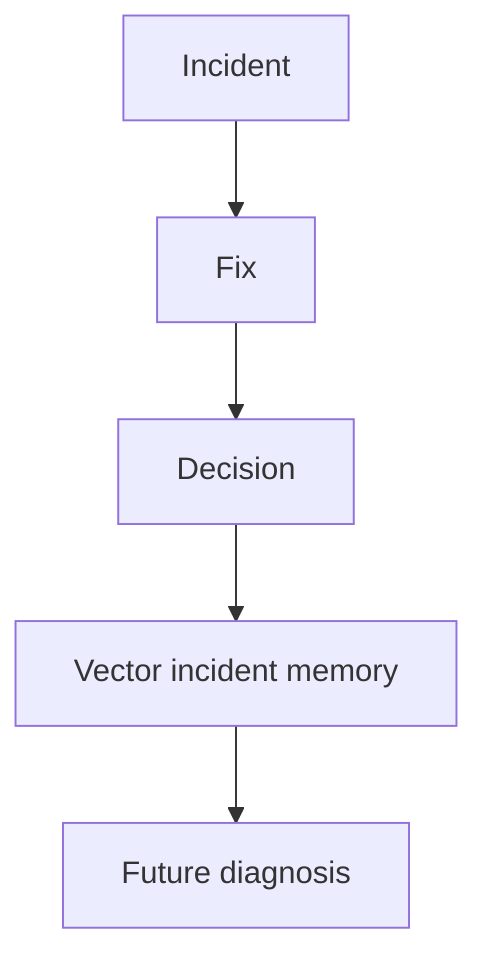

### Diagram 5: Evidence Loop Used Every Day

Revision prompt: explain each box, then name one risk and one control for this flow.

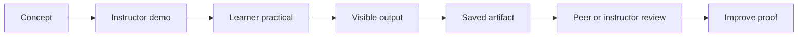

### Diagram 6: VM To GCP Translation Map

Revision prompt: explain each box, then name one risk and one control for this flow.

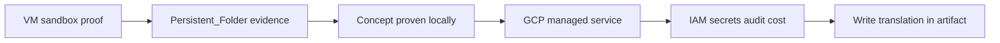

### Diagram 7: 16:00-16:15 - Restart From Saved Proof And Re-Anchor

Revision prompt: explain each box, then name one risk and one control for this flow.

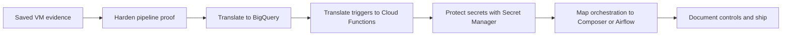

### Diagram 8: 7. Second-Half VM Proof Hardening

Revision prompt: explain each box, then name one risk and one control for this flow.

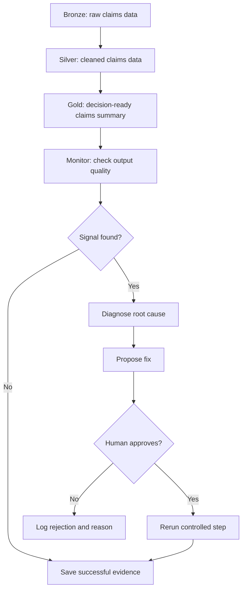

### Diagram 9: 8.1 BigQuery Mapping

Revision prompt: explain each box, then name one risk and one control for this flow.

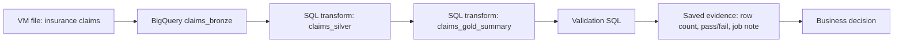

### Diagram 10: 8.2 Cloud Functions Trigger Mapping

Revision prompt: explain each box, then name one risk and one control for this flow.

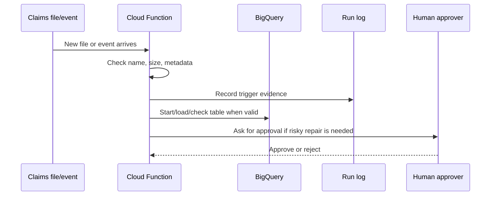

### Diagram 11: 8.4 Composer / Airflow Orchestration Mapping

Revision prompt: explain each box, then name one risk and one control for this flow.

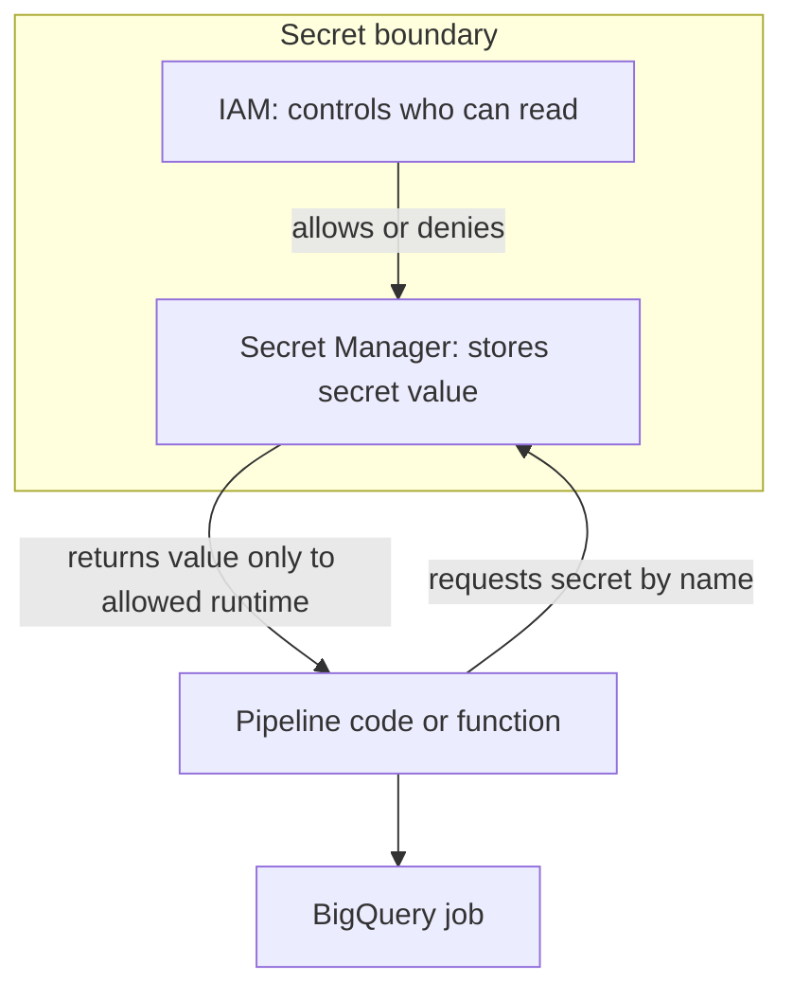

### Diagram 12: 8.4 Composer / Airflow Orchestration Mapping

Revision prompt: explain each box, then name one risk and one control for this flow.

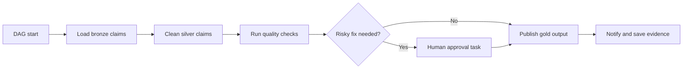

### Diagram 13: 9.1 Claude Usage Modes

Revision prompt: explain each box, then name one risk and one control for this flow.

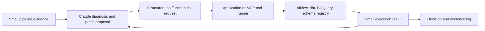

### Diagram 14: 10.2 Sample Claude Diagnosis

Revision prompt: explain each box, then name one risk and one control for this flow.

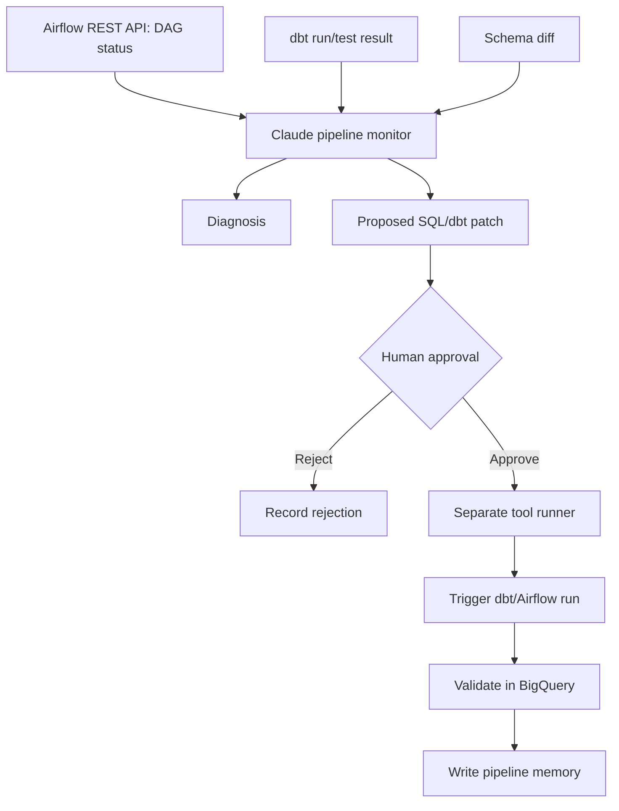

### Diagram 15: 10.2 Sample Claude Diagnosis

Revision prompt: explain each box, then name one risk and one control for this flow.

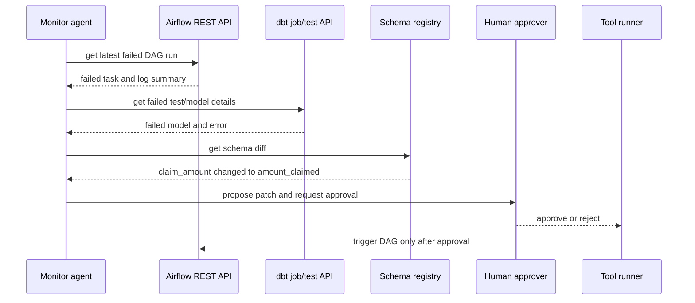

### Diagram 16: 12. Day 2 Course Syllabus Coverage Check

Revision prompt: explain each box, then name one risk and one control for this flow.

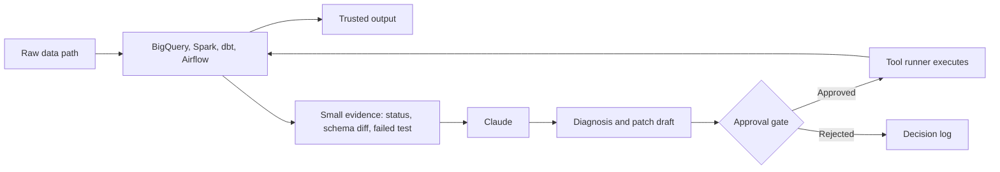

### Diagram 17: 12. Day 2 Course Syllabus Coverage Check

Revision prompt: explain each box, then name one risk and one control for this flow.

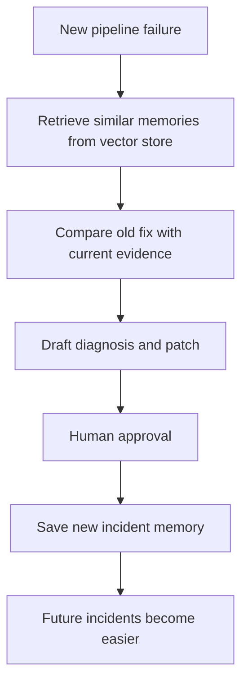

### Diagram 18: 12. Day 2 Course Syllabus Coverage Check

Revision prompt: explain each box, then name one risk and one control for this flow.

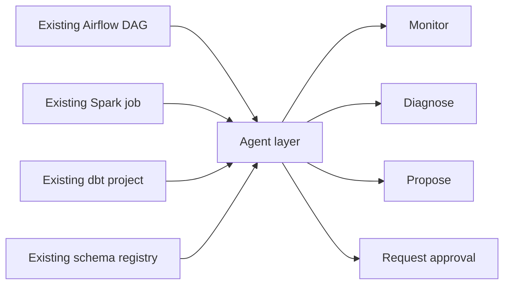

### Diagram 19: 16. Failure Injection And Recovery Scenario

Revision prompt: explain each box, then name one risk and one control for this flow.

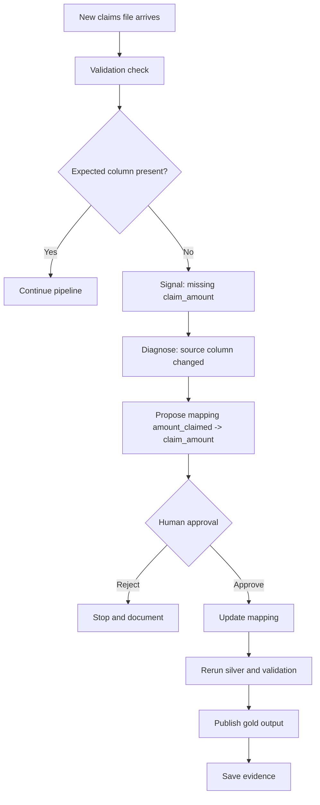

### Diagram 20: 18. Peer Review

Revision prompt: explain each box, then name one risk and one control for this flow.

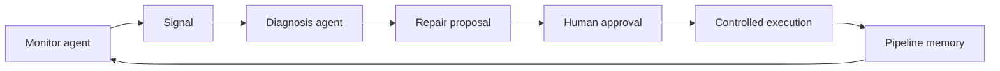

## 8. Revision Notes And Checks

- Do not say a tool was used unless you can point to evidence.
- Do not trust AI output until the source, permission, test result or approval is visible.
- Do not include secrets, tokens, private URLs or credentials in shared artifacts.
- For every practical, be able to answer: what data, what output, what risk, what control, what limitation?
- For every GCP translation, be able to say what the VM proved and what the managed service would own in production.

## 9. Self-Quiz

| # | Question | Expected answer shape |
|---:|---|---|
| 1 | What is the main artifact for today? | Name the exact `.md` file and evidence folder. |
| 2 | What business decision does the artifact support? | Say the decision and why wrong data would hurt it. |
| 3 | What is the strongest proof you saved? | Name a row count, output, diagram, test, log, decision or review. |
| 4 | What is the main trust boundary? | Say what AI/tool may suggest and what needs platform or human control. |
| 5 | What is the GCP translation? | Name the GCP services and their responsibility. |

## 10. Practice Before The Next Class

Spend 20-30 minutes improving the saved artifact:

1. Add one stronger proof line.
2. Add or redraw one Mermaid diagram from this pack.
3. Add one clearer risk and one control before trust.
4. Add one honest limitation: what the class demo does not prove yet.
5. Add one question to bring to the next class.

## 11. Shareable Checklist

- [ ] My artifact is saved in the persistent folder.
- [ ] My artifact names the dataset or fallback dataset.
- [ ] My artifact includes the business decision.
- [ ] My artifact includes at least one visible proof.
- [ ] My artifact includes at least one risk and one control.
- [ ] My artifact includes the GCP translation.
- [ ] My artifact does not expose secrets or private lab access.
- [ ] I can explain at least two diagrams without reading the full script.

## 12. Further Study Links

Use these for follow-up reading. Prefer official documentation when tool behavior matters.

- [Airflow DAGs](https://airflow.apache.org/docs/apache-airflow/stable/core-concepts/dags.html)
- [Airflow Tasks](https://airflow.apache.org/docs/apache-airflow/stable/core-concepts/tasks.html)
- [Airflow architecture overview](https://airflow.apache.org/docs/apache-airflow/stable/core-concepts/overview.html)
- [dbt data tests](https://docs.getdbt.com/docs/build/data-tests)
- [dbt Semantic Layer](https://docs.getdbt.com/docs/use-dbt-semantic-layer/dbt-sl)
- [dbt semantic models](https://docs.getdbt.com/docs/build/semantic-models)
- [BigQuery quickstart: load and query data in the console](https://docs.cloud.google.com/bigquery/docs/quickstarts/load-data-console)
- [Run BigQuery queries](https://docs.cloud.google.com/bigquery/docs/running-queries)
- [BigQuery partitioned tables](https://docs.cloud.google.com/bigquery/docs/partitioned-tables)
- [BigQuery clustering](https://docs.cloud.google.com/bigquery/docs/clustering-overview)
- [BigQuery time travel and historical data](https://docs.cloud.google.com/bigquery/docs/time-travel)
- [Cloud Storage buckets](https://docs.cloud.google.com/storage/docs/creating-buckets)
- [Secret Manager overview](https://docs.cloud.google.com/secret-manager/docs/overview)
- [Cloud Run deploy from source](https://docs.cloud.google.com/run/docs/deploying-source-code)
- [Cloud Functions concepts](https://docs.cloud.google.com/functions/docs/concepts/overview)
- [Firestore overview](https://docs.cloud.google.com/firestore/docs/overview)
- [Pub/Sub overview](https://docs.cloud.google.com/pubsub/docs/overview)
- [Apache Airflow DAGs](https://airflow.apache.org/docs/apache-airflow/stable/core-concepts/dags.html)
- [Apache Airflow REST API](https://airflow.apache.org/docs/apache-airflow/2.10.4/stable-rest-api-ref.html)
- [BigQuery documentation](https://docs.cloud.google.com/bigquery/docs)
- [Vertex AI RAG Engine](https://cloud.google.com/vertex-ai/generative-ai/docs/rag-engine/rag-overview)
- [Model Context Protocol tools](https://modelcontextprotocol.io/specification/2025-06-18/server/tools)

## 13. Bridge To The Next Day

Tomorrow should not restart from zero. Bring forward today's saved artifact, strongest proof, weakest risk/control, and one question. The next class builds on this evidence.
