# Day 3 - Data Quality, Governance, Catalog And MDM - Learner Revision, Diagrams And Study Pack

Share this Markdown with learners after class. It is for revision, redraw practice and hands-on follow-up. It does not include private lab credentials, URLs, tokens or screenshots.

## 1. Today In One Paragraph

Today added the trust layer to the data value chain: quality checks, data contracts, observability, catalog/glossary, PII classification, access policy, lineage, privacy deletion proof, and an agentic MDM golden-record candidate with steward approval. The main idea is simple: data is not trusted because it exists; data is trusted when the controls and evidence around it are visible.

**Memory line:** Governance is not paperwork after the build; it is the control system inside the build.

## 2. Course Syllabus Outcomes Covered

- Enforce data quality using dimensions, tests, contracts and observability.
- Govern data and AI assets with a catalog entry, glossary term, lineage, classification and access policy.
- Explain policy-as-code, row/column security, model/tool/agent governance and business semantics in simple language.
- Build an agentic MDM match/merge step that proposes golden-record candidates for steward approval.
- Explain privacy and compliance: PII classification, DPDP/GDPR-style right to deletion, source-of-record lineage and auditable deletion proof.
- Apply contracts, classification and MDM to the insurance lane.

## 3. Dataset, Tools And Saved Evidence

| Item | What to remember |
|---|---|
| Demo lane | ``Insurance`` |
| Primary dataset | ``Insurance/Insurance/insurance policy data.xlsx`` |
| Fallback dataset | ``Healthcare/healthcare_regular_audit_dataset_1000.csv`` |
| Evidence folder | `Persistent_Folder/day-03-evidence` |
| Main Markdown artifact | `day-03-governance-catalog-mdm.md` |
| Notebook/proof file | `day-03-quality-pii-mdm.ipynb` |
| GCP translation | BigQuery quality queries, BigQuery policy tags/column security, Dataplex/Data Catalog concept, Cloud SQL golden-record concept, IAM, audit logs, Secret Manager. |
| AI assistants | Codex or Claude Code can draft rules, but learners must inspect and correct assumptions. |

## 4. Practical Steps Learners Should Be Able To Repeat

1. Create `Persistent_Folder/day-03-evidence` and `day-03-governance-catalog-mdm.md`.
2. Load the insurance dataset or clearly record fallback usage.
3. Capture row count, column list and first visible proof.
4. Run quality checks for completeness, validity, timeliness and distribution.
5. Write a data contract draft with schema, freshness, quality SLA, PII handling and change handling.
6. Create observability notes for freshness, volume, schema and distribution.
7. Create catalog entry, glossary entry, PII classification and access policy.
8. Write column-level lineage and privacy/deletion proof flow.
9. Build or simulate the H1 Insurance agentic match/merge golden-record candidate.
10. Record steward decision, confidence, risk and approval boundary.
11. Map the Day 3 trust layer to BigQuery, policy tags, IAM, Cloud SQL and audit logs.

## 5. Live-Class Flow Recap

| Time | What happened | What to revise |
|---|---|---|
| 11:00-11:15 | Greeting, Recall And Day 3 Promise | Explain the concept and point to the evidence. |
| 11:15-11:35 | Opening Story And Whiteboard: Why Trust Layer Exists | Explain the concept and point to the evidence. |
| 11:35-12:05 | Mini Lecture 1: Data Quality, Contracts And dbt-Style Tests | Explain the concept and point to the evidence. |
| 12:05-12:35 | Practical 1: Create The Evidence Folder, Notebook And Load Proof | Repeat the step or inspect the saved artifact. |
| 12:35-13:15 | Practical 2: Quality Checks And Contract Template | Repeat the step or inspect the saved artifact. |
| 13:15-13:40 | Practical 3: Use Codex Or Claude Code Safely For Quality Rules | Repeat the step or inspect the saved artifact. |
| 13:40-14:15 | Mini Lecture 2 And Lab: Data Observability And AI-Driven Quality Monitoring | Repeat the step or inspect the saved artifact. |
| 14:15-14:45 | Mini Lecture 3 And Lab: Catalog, Glossary, Classification, Access And AI Governance | Repeat the step or inspect the saved artifact. |
| 16:00-16:15 | Restart From Saved Trust Proof | Explain the concept and point to the evidence. |
| 16:15-16:45 | Post-Lunch Concept: MDM, Entity Resolution And Survivorship | Explain the concept and point to the evidence. |
| 16:45-17:25 | Practical 4: Build Agentic Match/Merge Candidate For H1 Insurance | Repeat the step or inspect the saved artifact. |
| 17:25-17:50 | Mini Lecture And Lab: Reference Data, Active Metadata And Quality Automation | Repeat the step or inspect the saved artifact. |
| 17:50-18:20 | GCP Translation Lab: BigQuery Policy Tags, Cloud SQL Golden Record, IAM And Audit | Repeat the step or inspect the saved artifact. |
| 18:20-18:45 | Learner Build And Peer Review: Governed Entity Entry | Check whether the artifact is defensible. |
| 18:45-19:10 | Syllabus Coverage, Misconceptions And Ship Review | Check whether the artifact is defensible. |
| 19:10-19:30 | Feedback, Homework And Close | Check whether the artifact is defensible. |

## 6. Key Concepts In Simple Words

| Concept | Simple meaning |
|---|---|
| Data quality | Checking whether data is complete, valid, accurate enough and fresh enough for the decision. |
| Data contract | A producer-consumer promise about schema, freshness, quality, ownership, PII handling and change handling. |
| Observability | Continuous monitoring of freshness, volume, schema and distribution so incidents are detected early. |
| Catalog control plane | The place that controls meaning, owner, classification, lineage, access policy and AI usage decisions. |
| Business glossary | A shared definition of terms so people and agents use the same meaning. |
| PII classification | Marking columns that can identify people so access and masking controls can be enforced. |
| Policy-as-code | Access and governance rules expressed in a repeatable, enforceable way. |
| Lineage | A trace of where data came from, how it changed and where it is used. |
| Right to deletion | A privacy workflow that requires source-of-record, downstream lineage, approved action and audit proof. |
| MDM | Master Data Management: deciding which records represent the same real-world entity. |
| Golden record | The approved best representation of a person, provider, vendor, policyholder or entity. |
| Survivorship rule | The rule for which source value wins when systems disagree. |
| Stewardship | Human review and approval for governance actions such as risky merges or policy changes. |
| Active metadata | Metadata that triggers decisions: access, classification, catalog suggestions, quality workflows or AI restrictions. |

## 7. Diagrams To Redraw And Revise

These are the same diagrams placed inline in the teleprompter. Redraw them after class. For each arrow, say what responsibility moves, what can go wrong and what evidence proves the control worked.

### Diagram 1: Day 3 Trust Layer

Revision prompt: explain each box, then name one risk and one control for this flow.

```mermaid
flowchart LR
    Data[Insurance data product] --> Quality[Quality checks]
    Quality --> Contract[Data contract]
    Contract --> Catalog[Catalog and glossary]
    Catalog --> Classify[PII classification]
    Classify --> Policy[Access policy]
    Policy --> Lineage[Lineage and audit]
    Lineage --> MDM[MDM golden record]
    MDM --> Steward[Steward approval]
    Steward --> Trusted[Trusted governed product]
```

### Diagram 2: Quality Dimensions To Tests

Revision prompt: explain each box, then name one risk and one control for this flow.

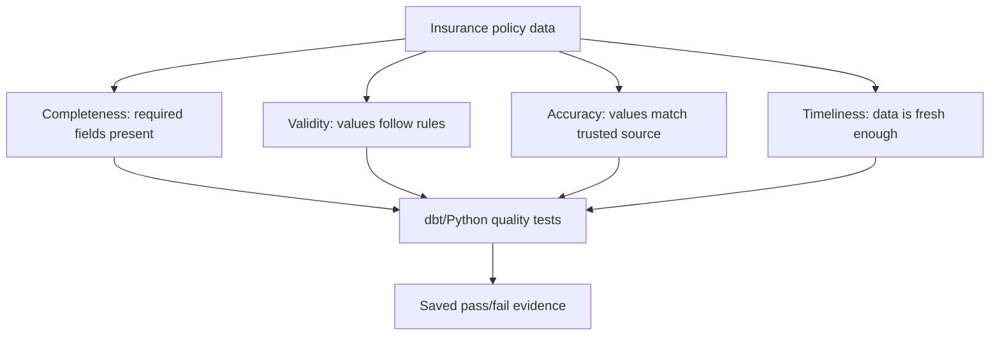

### Diagram 3: Data Contract As Producer Consumer Promise

Revision prompt: explain each box, then name one risk and one control for this flow.

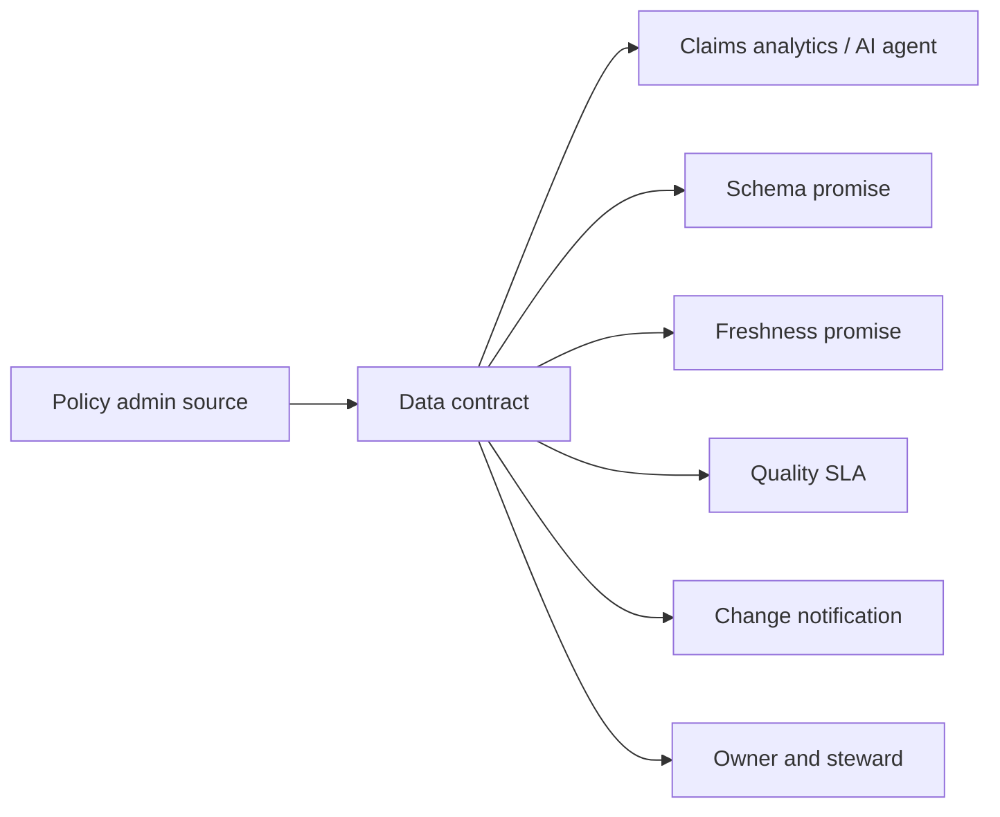

### Diagram 4: Evidence Loop Used Every Day

Revision prompt: explain each box, then name one risk and one control for this flow.

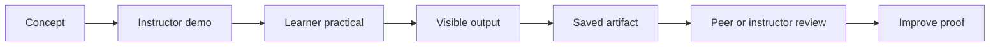

### Diagram 5: Observability Control Loop

Revision prompt: explain each box, then name one risk and one control for this flow.

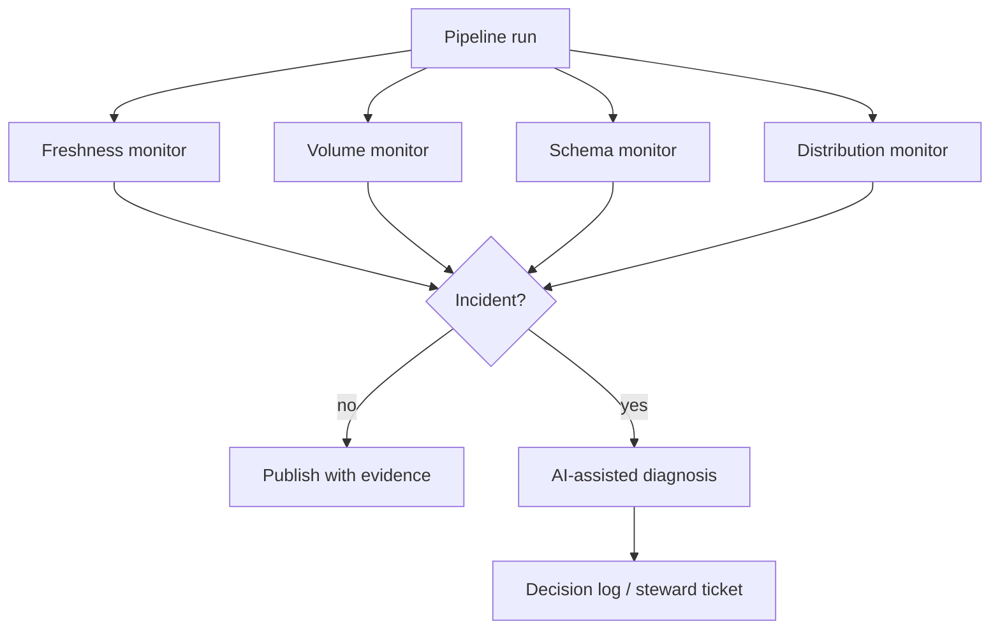

### Diagram 6: Catalog As Control Plane

Revision prompt: explain each box, then name one risk and one control for this flow.

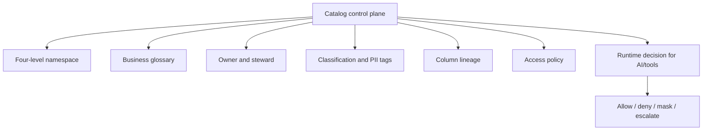

### Diagram 7: Policy And AI Governance Boundary

Revision prompt: explain each box, then name one risk and one control for this flow.

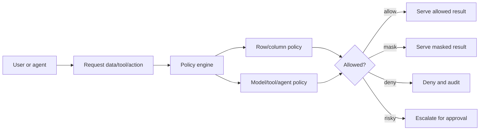

### Diagram 8: Privacy Deletion With Lineage

Revision prompt: explain each box, then name one risk and one control for this flow.

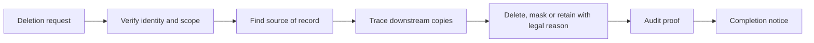

### Diagram 9: Agentic MDM Match Merge

Revision prompt: explain each box, then name one risk and one control for this flow.

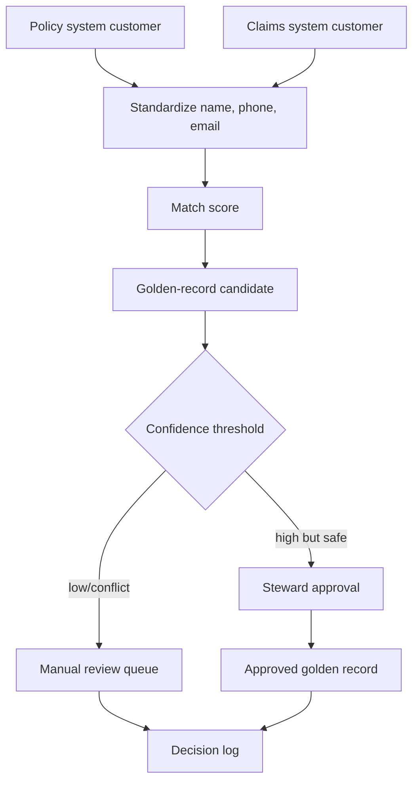

### Diagram 10: Reference And Active Metadata

Revision prompt: explain each box, then name one risk and one control for this flow.

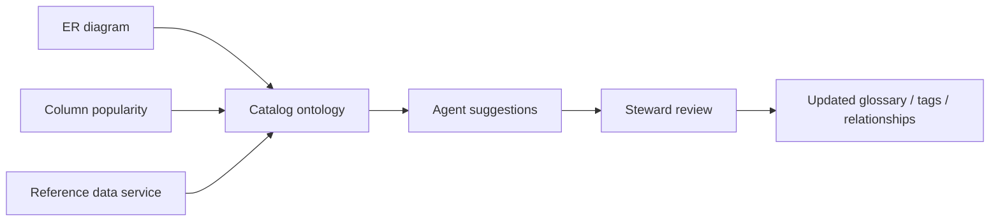

### Diagram 11: GCP Trust Layer Translation

Revision prompt: explain each box, then name one risk and one control for this flow.

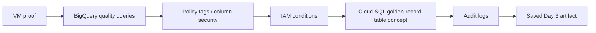

### Diagram 12: Inline Teaching Diagram

Revision prompt: explain each box, then name one risk and one control for this flow.

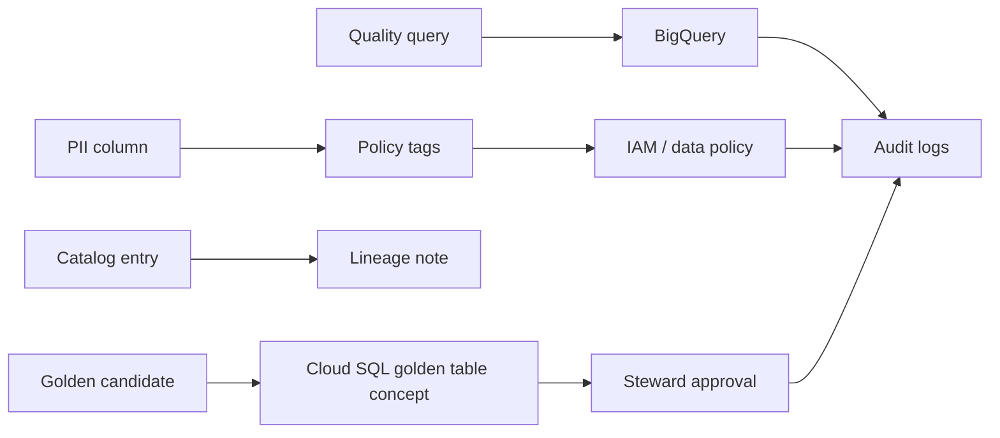

## 8. Artifact Completion Checklist

| Required evidence | Complete? | Where to check |
|---|---:|---|
| Dataset load proof | yes/no | Section 3.1 |
| Quality check report | yes/no | Section 3.2 |
| Data contract draft | yes/no | Section 3.3 |
| Observability note | yes/no | Section 4 |
| Catalog entry | yes/no | Section 5.1 |
| Glossary entry | yes/no | Section 5.2 |
| PII classification | yes/no | Section 5.3 |
| Access policy | yes/no | Section 5.4 |
| Lineage/deletion workflow | yes/no | Section 6 |
| MDM golden candidate | yes/no | Section 7.2 |
| Steward decision log | yes/no | Section 7.3 |
| GCP translation | yes/no | Section 8 |
| No secrets exposed | yes/no | Whole artifact |

## 9. Platform Vocabulary And Industry Transfer

### 9.1 Governance Platform Vocabulary

| Term | Plain meaning | What to remember |
|---|---|---|
| Unity Catalog | Lakehouse catalog and governance plane | Controls tables, permissions, lineage and AI/data assets in Databricks-style environments. |
| Collibra / Alation / Atlan | Enterprise catalog and governance platforms | Glossary, lineage, classification, ownership and stewardship workflows. |
| Immuta / Privacera | Policy-as-code and access governance platforms | Row/column controls, masking, purpose-based access and policy enforcement. |
| Unity AI Gateway style control | AI action governance | Governs what AI can do, not only what data a person can read. |
| MCP service / agent / skill governance | Tool governance for AI systems | Controls which tool calls are allowed, denied, masked or escalated. |

### 9.2 Privacy And Compliance Translation

| Regulation idea | Plain classroom meaning | Day 3 evidence |
|---|---|---|
| DPDP-style personal data protection | Know personal data purpose, protect it and act responsibly. | PII classification and access policy. |
| GDPR right to erasure | A person may request deletion where legally applicable. | Deletion workflow and lineage trace. |
| Source-of-record lineage | Know where the authoritative value lives. | Source and downstream lineage table. |
| Audited deletion | Deletion/masking must leave proof. | Request ID, approver, action and timestamp. |

### 9.3 Hands-On Variants From The Course Syllabus

| Industry lane | How Day 3 pattern applies | Expected ship artifact |
|---|---|---|
| Banking | Add dbt-style tests and break the pipeline on a contract violation. | Contract violation plus test proof. |
| Insurance | Classify and tag PII columns and apply row/column-level access thinking. | Governed insurance product with PII policy. |
| Healthcare | Trace column-level lineage from source to report for audit. | Lineage proof and privacy workflow. |
| Insurance MDM | Build agentic match/merge candidate for steward approval. | Golden-record candidate plus approval log. |
| Banking anomaly | Wire anomaly detection to catalog so quality breaches are explained. | Explained quality incident. |
| Supply chain | Add glossary and metric view so agents answer with one shared meaning. | Governed semantic entry. |

## 10. Self-Quiz

| # | Question | Expected answer shape |
|---:|---|---|
| 1 | What are the four quality dimensions used today? | Completeness, validity, accuracy and timeliness; distribution/freshness monitoring is also used for observability. |
| 2 | What is a data contract? | A producer-consumer promise about schema, freshness, quality, ownership, PII and change handling. |
| 3 | Why is the catalog a control plane? | It controls meaning, ownership, classification, lineage, access and AI runtime decisions. |
| 4 | Why do we need lineage for deletion? | To find source of record and downstream copies before delete/mask/retain decisions. |
| 5 | Why can an agent propose but not approve a merge? | Wrong merges can harm people/business decisions; a steward must approve risky identity resolution. |

## 11. Practice Before Tomorrow

Spend 20-30 minutes improving `day-03-governance-catalog-mdm.md`:

1. Add one stronger quality evidence line.
2. Add one clearer PII classification/access policy row.
3. Add one lineage or deletion proof row.
4. Add one completed golden-record steward decision row.
5. Add one question for Day 4 about serving governed data to AI and agents.

## 12. Further Study Links

- [dbt data tests](https://docs.getdbt.com/docs/build/data-tests)
- [dbt model contracts](https://docs.getdbt.com/docs/mesh/govern/model-contracts)
- [OpenLineage project](https://openlineage.io/)
- [OpenLineage column lineage facet](https://openlineage.io/docs/spec/facets/dataset-facets/column_lineage_facet/)
- [BigQuery column-level security](https://docs.cloud.google.com/bigquery/docs/column-level-security)
- [BigQuery tags for access control](https://docs.cloud.google.com/bigquery/docs/tags)
- [Data Catalog policy tags API](https://docs.cloud.google.com/data-catalog/docs/reference/rest)
- [Atlan lineage concepts](https://docs.atlan.com/product/capabilities/lineage/concepts/what-is-lineage)
- [Immuta row-level policies](https://documentation.immuta.com/SaaS/governance/secure-your-data/authoring-policies-in-secure/data-policies/reference-guides/row-redaction-explained)
- [GDPR right to erasure](https://gdpr.eu/right-to-be-forgotten/)

## 13. Bridge To Day 4

Day 4 serves data to AI and agents. Day 3 is the safety base for that. If catalog, classification, lineage and access policy are weak, then a text-to-SQL or RAG answer can be fast and still unsafe.
