# Day 4 - Serving Data To AI And Agents - Learner Revision, Diagrams And Study Pack

Share this Markdown with learners after class. It is designed for revision, redraw practice, hands-on repeat practice and interview-style explanation. It contains no private lab credentials, tokens or sandbox URLs.

## 1. Today In One Paragraph

Today we learned how governed data is safely exposed to AI and agents. The key idea is that an AI agent should not directly touch raw data. The model may draft SQL or retrieval intent, but a trusted platform must check permissions, run the query, limit the result, cite the sources and write an audit trail. We built this pattern using a semantic metric, text-to-SQL inspection, a read-only SQL guard, PII and query-budget controls, permission-aware retrieval, RAG, GraphRAG, evaluation checks and a GCP production translation.

**Memory line:** The model writes SQL; the platform enforces trust.

## 2. Course Syllabus Outcomes Covered

- Build a semantic layer so one metric definition is reused by dashboards, SQL and agents.
- Build a governed text-to-SQL/data-agent flow that is read-only, audited and permission-aware.
- Serve structured and unstructured data to agents using RAG and GraphRAG.
- Explain why SQL execution belongs inside the trust boundary, not inside the model.
- Add query budgets, PII guards, row/column access thinking, citations and audit rows.
- Evaluate an agent using faithfulness, SQL correctness, trajectory, latency and cost.

## 3. Dataset, Tools And Saved Evidence

| Item | What to remember |
|---|---|
| Demo lane | `Insurance` |
| Primary dataset | `Insurance/Insurance Claims Fraud Data/Insurance Claims Fraud Data.zip` |
| Fallback dataset | `Banking/Sample data/Sample.xlsx` |
| VM evidence folder | `Persistent_Folder/day-04-evidence` |
| Main Markdown artifact | `day-04-governed-agent-audit.md` |
| Notebook/proof file | `day-04-text-to-sql-rag-boundary.ipynb` |
| AI assistants | Codex or Claude Code can draft SQL or explanations, but learners must inspect before accepting. |
| GCP translation | BigQuery, Vertex AI/RAG Engine, Sensitive Data Protection, Secret Manager, Cloud Run, IAM, row-level security, policy tags, Cloud Logging/Audit Logs |

## 4. Practical Flow To Repeat

1. Create `Persistent_Folder/day-04-evidence`.
2. Create `day-04-governed-agent-audit.md`.
3. Create `day-04-text-to-sql-rag-boundary.ipynb`.
4. Load the insurance dataset or honestly record the fallback dataset.
5. Save row count, column list and likely sensitive columns.
6. Define the semantic metric `claim_approval_rate`.
7. Ask Codex or Claude Code to draft read-only SQL from visible columns only.
8. Inspect the SQL before execution.
9. Run the local SQL guard to prove one allowed query and one blocked query.
10. Save the audit rows.
11. Add user entitlements and explain permission-aware serving.
12. Build a small RAG answer with citations.
13. Build a small GraphRAG path over customer, policy, claim and document.
14. Run or review the GCP live demo evidence: BigQuery table, safe view, audit rows, PII check, fake Secret Manager secret and Vertex AI/RAG Engine translation.
15. Record cleanup status for any GCP resources created.
16. Complete the evaluation, cost and latency checklist.

## 4A. GCP Live Demo Steps To Revise

This section mirrors the live screen-share demo. Use it to revise what each GCP service proved.

### 4A.1 Preflight

The instructor first confirmed the active project and account without exposing credentials:

```bash
gcloud config get-value project
gcloud auth list --filter=status:ACTIVE --format="value(account)"
```

Then the instructor created unique demo names:

```bash
export PROJECT_ID="$(gcloud config get-value project)"
export REGION="us-central1"
export DEMO_SUFFIX="$(date +%m%d%H%M)"
export BQ_DATASET="dm_day4_${DEMO_SUFFIX}"
export BQ_TABLE="insurance_claims"
export BUCKET="dm-day4-${PROJECT_ID}-${DEMO_SUFFIX}"
```

Why this matters: unique names avoid collisions and make cleanup easier.

### 4A.2 BigQuery Raw Table

The instructor created a tiny `insurance_claims` table with four rows. It intentionally included `claimant_email` and `claimant_phone` so the class could see why AI serving needs PII controls.

Key evidence:

| BigQuery object | Purpose |
|---|---|
| `dm_day4_<suffix>` | throwaway Day 4 dataset |
| `insurance_claims` | raw demo claims table with PII-like fields |
| `claims_agent_safe_view` | safe serving view excluding email and phone |
| `agent_query_audit` | allowed/blocked query decisions |

### 4A.3 BigQuery Semantic Metric

The metric query was:

```sql
SELECT
  COUNTIF(status = 'approved') AS approved_claims,
  COUNTIF(status IN ('approved','rejected','review')) AS reviewed_claims,
  SAFE_DIVIDE(COUNTIF(status = 'approved'), COUNTIF(status IN ('approved','rejected','review'))) AS claim_approval_rate
FROM `<project>.<dataset>.insurance_claims`;
```

Why this matters: the formula came from the approved semantic metric, not from model guesswork.

### 4A.4 Safe View

The safe serving view removed raw PII:

```sql
CREATE OR REPLACE VIEW `<project>.<dataset>.claims_agent_safe_view` AS
SELECT
  claim_id,
  policy_id,
  customer_id,
  region,
  status,
  claim_amount
FROM `<project>.<dataset>.insurance_claims`;
```

Why this matters: the agent should read a governed serving surface by default, not the raw table.

### 4A.5 Allowed And Blocked Audit Rows

Two audit rows were recorded:

| Audit row | Meaning |
|---|---|
| allowed | aggregate claim approval question over safe serving surface |
| blocked | request for raw claimant emails was denied |

Why this matters: a blocked request is proof that the guardrail works.

### 4A.6 PII Check

If Sensitive Data Protection was available, the instructor showed where a BigQuery inspection job would run. If not, the fallback query counted likely emails and phone numbers:

```sql
SELECT
  COUNTIF(REGEXP_CONTAINS(claimant_email, r'@')) AS likely_email_count,
  COUNTIF(REGEXP_CONTAINS(claimant_phone, r'^[0-9]{10}$')) AS likely_phone_count
FROM `<project>.<dataset>.insurance_claims`;
```

Why this matters: before serving data to an agent, teams must know whether sensitive data exists.

### 4A.7 Secret Manager

The instructor created only a fake secret:

```bash
export SECRET_NAME="day4-fake-agent-key-${DEMO_SUFFIX}"
printf "not-a-real-secret-classroom-demo" | gcloud secrets create "${SECRET_NAME}" \
  --replication-policy="automatic" \
  --data-file=-
```

Why this matters: secrets belong outside code, notebooks, prompts and screenshots.

### 4A.8 Vertex AI / RAG Engine

The instructor staged a tiny approved policy document in Cloud Storage, then showed Vertex AI, RAG Engine or Agent Builder if available.

The policy document said:

- claim approval rate must use the approved metric,
- raw claimant email and phone must not be returned to a general analytics agent,
- every natural-language data question must record user, question, SQL/retrieval plan, sources and allow/deny decision,
- if evidence is insufficient, the agent must say so.

Why this matters: local RAG proves the pattern; Vertex AI/RAG Engine is the managed GCP translation.

### 4A.9 Cleanup

Cleanup commands used or recorded:

```bash
test -n "${SECRET_NAME}" && gcloud secrets delete "${SECRET_NAME}" --quiet
test -n "${BUCKET}" && gcloud storage rm --recursive "gs://${BUCKET}"
test -n "${PROJECT_ID}" && test -n "${BQ_DATASET}" && bq rm -r -f -d "${PROJECT_ID}:${BQ_DATASET}"
```

Why this matters: cloud cleanup is part of professional delivery.

## 5. Concepts In Simple Words

| Concept | Simple explanation |
|---|---|
| Semantic layer | A governed place where business metrics are defined once. |
| Semantic metric | A metric with name, formula, grain, allowed dimensions, owner, access rule and lineage. |
| Text-to-SQL | An AI model converts a natural-language question into SQL. |
| Trust boundary | The line between what AI may suggest and what a governed platform may run. |
| Read-only SQL guard | A check that blocks write operations, `SELECT *`, PII access and oversized queries. |
| Query budget | A limit on rows, query size or spend so an agent cannot overuse the platform. |
| PII guard | A control that blocks or masks sensitive columns such as name, email, phone, address or date of birth. |
| Permission-aware serving | The agent gets only the data rights of the user who asked the question. |
| RAG | Retrieve approved evidence first, then generate an answer from that evidence. |
| GraphRAG | Use entity relationships to answer multi-hop questions, not only text similarity. |
| Citation | The source document, table or record used to support an answer. |
| Audit row | A saved record of user, question, generated SQL/retrieval plan, policy decision, result size and sources. |
| Faithfulness | Whether the answer is supported by the retrieved evidence. |
| SQL correctness | Whether the generated SQL matches the approved metric and known schema. |
| Trajectory check | Whether the agent followed the correct path: plan, permission, guard, execute, cite, audit. |
| Semantic caching | Reusing safe repeated answers or metric results to reduce latency and cost. |
| Model tiering | Using a smaller/faster/cheaper model for simple tasks and stronger models only when needed. |

## 6. Diagram 1 - Governed Question Flow

Use this to explain the full Day 4 architecture.

```mermaid
flowchart LR
    User[Business question] --> Identity[User identity]
    Identity --> Policy[Permission check]
    Policy --> Semantic[Semantic metric definition]
    Semantic --> DraftSQL[Model drafts SQL]
    DraftSQL --> Guard[SQL guard: read-only, budget, PII]
    Guard --> Engine[Trusted engine runs query]
    Engine --> Result[Small result only]
    Result --> Cite[Answer with citations]
    Cite --> Audit[Audit row]
```

Revision question: Which box prevents metric confusion, and which boxes prevent leakage?

Expected answer: semantic metric definition prevents metric confusion; permission check and SQL guard prevent leakage.

## 7. Diagram 2 - Semantic Layer Metric Contract

Use this to explain why AI should not invent business definitions.

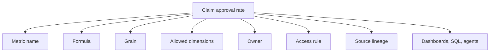

Revision question: Why is this better than letting every dashboard or agent calculate the metric separately?

Expected answer: one governed definition keeps dashboards, SQL and AI answers consistent.

## 8. Diagram 3 - Semantic Layer To SQL And Natural Language

Use this to explain metric consistency across two access modes.

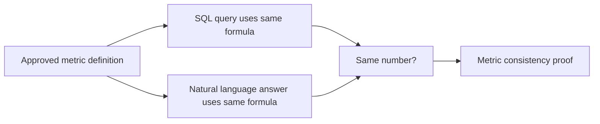

Revision question: What proves that the natural-language answer is not inventing a new formula?

Expected answer: it traces back to the approved semantic metric definition.

## 9. Diagram 4 - Text-To-SQL Trust Boundary

Use this to explain why model-generated SQL is a proposal, not an execution right.

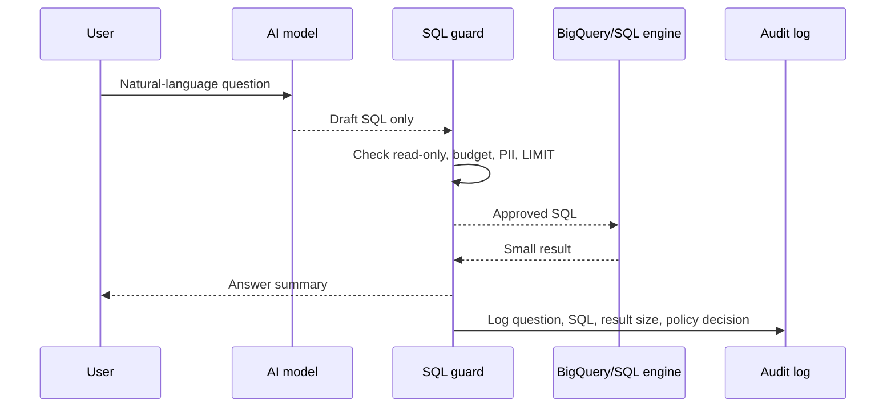

Revision question: What is the difference between drafting SQL and executing SQL?

Expected answer: drafting creates a proposal; execution must pass controls inside the trusted platform.

## 10. Diagram 5 - Read-Only Guard And Audit

Use this to explain why a blocked query is valuable evidence.

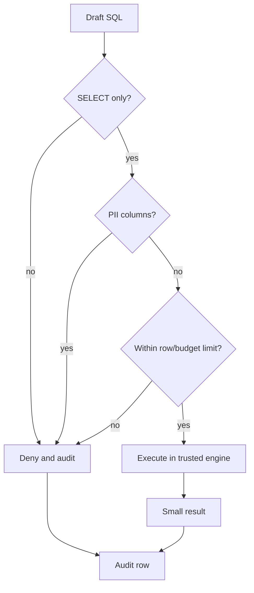

Revision question: Why did we intentionally run `SELECT * FROM claims_data LIMIT 5` as a blocked query?

Expected answer: to prove the guardrail works, not only the happy path.

## 11. Diagram 6 - Permission-Aware Retrieval

Use this to explain user entitlement propagation.

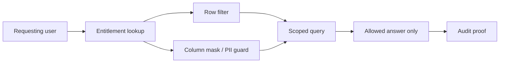

Revision question: Should an AI agent get more access than the user?

Expected answer: no. The agent should inherit or be constrained by the user's permissions.

## 12. Diagram 7 - Agentic RAG Over Structured And Unstructured Data

Use this to explain plan, retrieve, evaluate and refine.

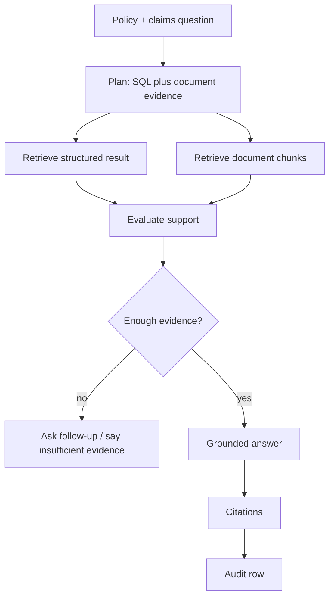

Revision question: What makes a RAG answer safer than a normal chatbot answer?

Expected answer: it retrieves approved evidence, cites sources and records limitations.

## 13. Diagram 8 - GraphRAG Entity Path

Use this to explain multi-hop questions.

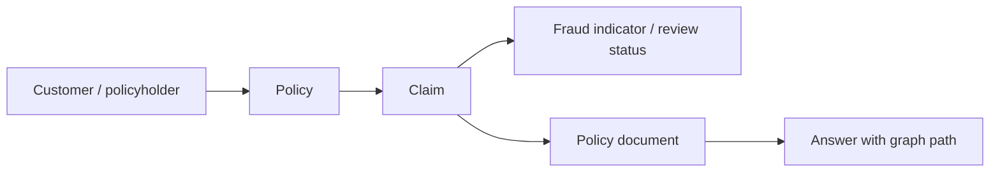

Revision question: When is GraphRAG better than simple RAG?

Expected answer: when relationships matter, such as customer to policy to claim to document, or supplier to part to shipment to incident.

## 14. Diagram 9 - Right-To-Be-Forgotten At The Index

Use this to explain why governance must follow data into indexes and caches.

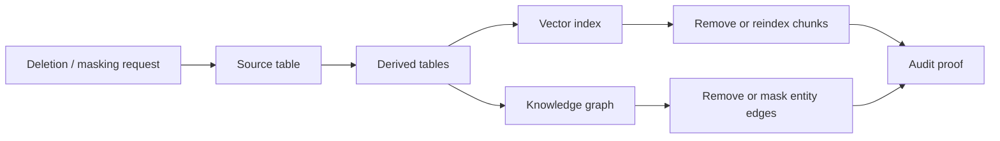

Revision question: Why is deleting from the source table not enough?

Expected answer: the data may still exist in derived tables, vector indexes, graph indexes, caches or document chunks.

## 15. Diagram 10 - GCP Governed Data Access Agent

Use this to translate the VM demo into production architecture.

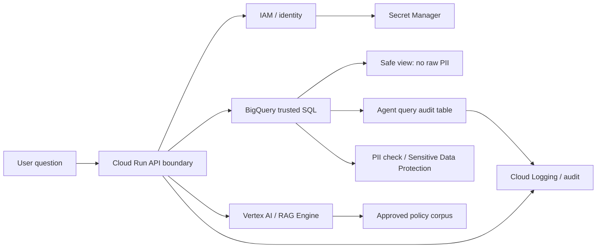

Revision question: Which service should execute SQL: the model or BigQuery?

Expected answer: BigQuery executes SQL. The model may draft SQL, but the platform enforces trust.

## 16. Diagram 11 - Evaluation And Cost Loop

Use this to explain how a data agent is tested before trust.

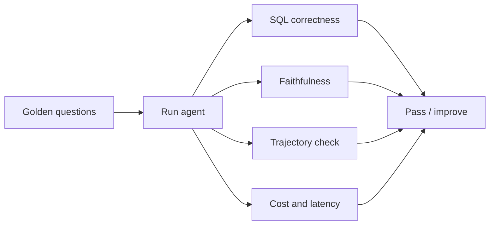

Revision question: What does a trajectory check prove?

Expected answer: it proves the agent followed the right path, including permission, guard, execution, citation and audit.

## 17. Diagram 12 - Evidence Loop Used In Class

Use this to remember the discipline used throughout the day.

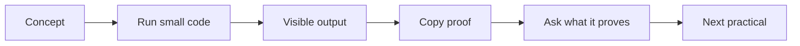

Revision question: Why do we save evidence after every practical?

Expected answer: because a visible result can disappear, but an artifact can be reviewed, audited and improved.

## 18. Artifact Completion Checklist

Your `day-04-governed-agent-audit.md` should contain:

- [ ] Dataset and lane.
- [ ] Business decision.
- [ ] Semantic metric definition for `claim_approval_rate`.
- [ ] Dataset load proof: row count, column list and likely sensitive columns.
- [ ] Generated SQL inspection checklist.
- [ ] Allowed query audit.
- [ ] Blocked query audit.
- [ ] Permission-aware serving and PII guard note.
- [ ] RAG answer with citations.
- [ ] GraphRAG path.
- [ ] Right-to-be-forgotten and index-trust note.
- [ ] GCP BigQuery dataset/table proof or fallback note.
- [ ] GCP safe view excluding raw PII.
- [ ] GCP allowed and blocked audit rows.
- [ ] GCP PII check using Sensitive Data Protection or fallback query.
- [ ] GCP fake Secret Manager proof with no secret value exposed.
- [ ] Vertex AI/RAG Engine or Agent Builder managed translation note.
- [ ] GCP cleanup status.
- [ ] Evaluation, cost and latency checklist.
- [ ] AI assistance used: accepted, rejected and assumptions.
- [ ] One honest limitation.

## 19. Industry Transfer

| Industry | Day 4 application | Example question |
|---|---|---|
| Insurance | Claims retrieval with citations | `Why did approval rate change and which policy controls the answer?` |
| Banking | Permission-aware customer analytics | `Show only the entitled customer's transaction summary.` |
| Finance and Accounts | Governed natural-language analytics | `What is month-end close variance using the approved metric?` |
| Supply Chain and Logistics | Metric consistency and GraphRAG path | `Which supplier, part and shipment path explains the delay?` |

## 20. Common Mistakes To Avoid

- Do not let the model directly query raw tables.
- Do not trust an answer without a metric definition, permission decision, citation or audit row.
- Do not allow `SELECT *` in a governed data agent.
- Do not expose raw PII just because the prompt asked for it.
- Do not treat a vector index as automatically governed.
- Do not confuse a correct-looking answer with a trusted answer.
- Do not hide fallback datasets. Record the fallback honestly.

## 21. Self-Quiz

| # | Question | Expected answer shape |
|---:|---|---|
| 1 | What is the Day 4 memory line? | The model writes SQL; the platform enforces trust. |
| 2 | What is a semantic layer? | A governed layer where metrics and business meanings are defined once. |
| 3 | Why should text-to-SQL be read-only by default? | It reduces damage and keeps execution inside governed controls. |
| 4 | What should an audit row contain? | User, question, SQL/retrieval plan, policy decision, result size, citations and timestamp. |
| 5 | What is the difference between RAG and GraphRAG? | RAG retrieves evidence chunks; GraphRAG also uses entity relationships and paths. |
| 6 | Why is permission-aware retrieval important? | The agent must not see more than the requesting user can see. |
| 7 | What is faithfulness? | Whether the answer is supported by retrieved evidence. |
| 8 | What is SQL correctness? | Whether SQL follows approved metric logic and known schema. |
| 9 | What is the GCP translation for the SQL engine? | BigQuery. |
| 10 | What is the GCP translation for the serving boundary? | Cloud Run. |
| 11 | What did the GCP safe view prove? | The agent can read a serving surface that excludes raw email and phone. |
| 12 | Why did we create a blocked audit row? | To prove unsafe requests can be denied and recorded. |

## 22. Practice Before The Next Class

Spend 30-45 minutes improving the artifact:

1. Redraw any three diagrams from this pack.
2. Add one stronger blocked-query proof.
3. Add one permission scenario: normal analyst versus data steward.
4. Add one RAG answer with at least two citations.
5. Add one GraphRAG path for a different industry lane.
6. Add one cost control: row limit, cache, cheaper model or query budget.
7. Add one honest limitation: what the class proof does not yet prove in production.

## 23. Further Study Links

Use official documentation first when tool behavior matters:

- [dbt Semantic Layer](https://www.getdbt.com/product/semantic-layer)
- [dbt semantic models](https://docs.getdbt.com/docs/build/semantic-models)
- [Cube introduction](https://docs.cube.dev/docs/introduction)
- [Cube data modeling](https://docs.cube.dev/docs/data-modeling/overview)
- [BigQuery data canvas and Gemini SQL assistance](https://docs.cloud.google.com/bigquery/docs/data-canvas)
- [BigQuery create datasets](https://docs.cloud.google.com/bigquery/docs/datasets)
- [BigQuery row-level security overview](https://docs.cloud.google.com/bigquery/docs/row-level-security-intro)
- [Manage BigQuery row-level security](https://docs.cloud.google.com/bigquery/docs/managing-row-level-security)
- [Sensitive Data Protection storage inspection](https://docs.cloud.google.com/sensitive-data-protection/docs/inspecting-storage)
- [Secret Manager quickstart](https://docs.cloud.google.com/secret-manager/docs/create-secret-quickstart)
- [Cloud Storage create buckets](https://docs.cloud.google.com/storage/docs/creating-buckets)
- [Vertex AI RAG Engine quickstart](https://docs.cloud.google.com/vertex-ai/generative-ai/docs/rag-quickstart)
- [Vertex AI Agent Builder](https://docs.cloud.google.com/agent-builder)
- [Microsoft GraphRAG overview](https://microsoft.github.io/graphrag/index/overview/)

## 24. Bridge To Day 5

Day 4 gave us a governed data-access agent. Day 5 should build on this by asking: once agents can access governed data, how do we operationalize them, monitor them and keep their decisions reliable over time?
