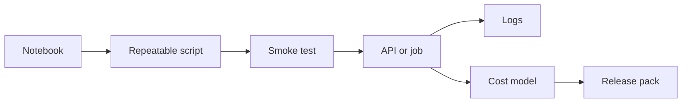
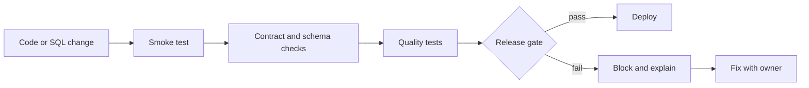
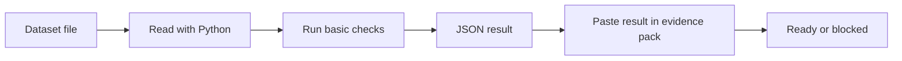
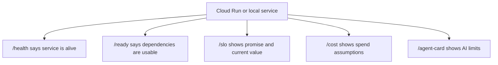
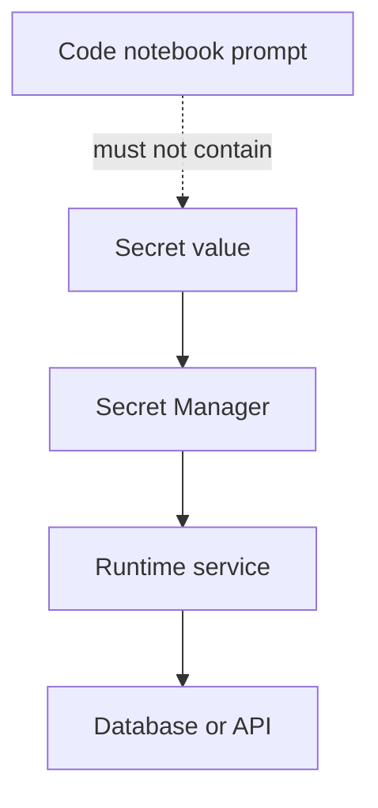
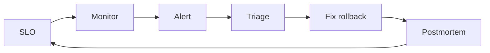
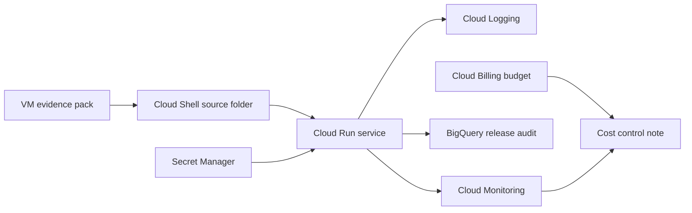
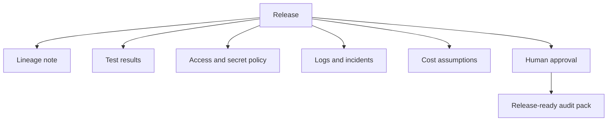
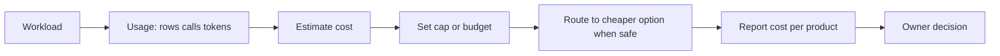
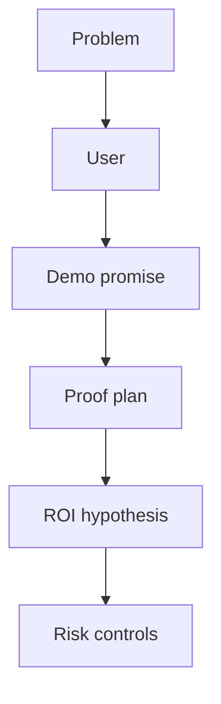

# Day 5 - Productionisation, DataOps, Security, Cost And Capstone - Learner Revision Pack

Share this Markdown after class. It is safe for learners: it contains no private lab URLs, credentials, tokens or secret values.

## 1. Today In One Paragraph

Today moved the class from working data demos to production thinking. We took an insurance dataset proof, wrapped it with a repeatable smoke test, exposed readiness through a tiny service pattern, translated the idea to GCP using Secret Manager, Cloud Run, Cloud Logging, Cloud Monitoring, BigQuery and Billing, and ended with a one-page DM capstone brief.

**Memory line:** A working notebook is evidence of learning, not evidence of production readiness.

## 2. What You Should Be Able To Explain

- DataOps means repeatable, tested, observable and owned data delivery.
- CI/CD means changes are checked before they are released.
- A smoke test proves the system is alive enough to continue; it does not prove everything.
- `/health` and `/ready` are different: health means alive, readiness means safe enough to serve.
- Secrets must not live in notebooks, prompts, chat or source code.
- SLO means service level objective: a measurable reliability promise.
- FinOps means cost visibility, ownership, caps and smarter routing.
- Responsible AI governance means agents have allowed actions, blocked actions and approval points.
- A capstone brief must name the problem, user, data product, architecture, evaluation plan, ROI and risks.

## 3. Class Artifacts

| Artifact | Purpose |
| --- | --- |
| `Persistent_Folder/day-05-evidence` | Persistent evidence folder for the day |
| `day-05-production-readiness-pack.md` | Main proof, notes, GCP translation and capstone brief |
| `day-05-productionisation-proof/smoke_test.py` | Repeatable data smoke test |
| `day-05-productionisation-proof/app.py` | Local service readiness pattern |
| `day-05-productionisation-proof/logs/smoke_test_result.json` | Saved smoke-test evidence |

Dataset lane:

- Lane: `Insurance`
- Primary dataset: `Insurance/Insurance/insurance_cash_application.csv`
- Fallback dataset: `Insurance/Insurance/Copy of uk_motor_claims_dummy_1000.xlsx`

## 4. Practical Repeat Steps

### Step 1 - Create Evidence Folder

```bash
cd ~/Persistent_Folder
mkdir -p day-05-evidence/day-05-productionisation-proof/logs
cd day-05-evidence/day-05-productionisation-proof
pwd
```

Expected proof: the folder path prints and includes `Persistent_Folder/day-05-evidence`.

### Step 2 - Create Requirements File

```text
pandas
flask
openpyxl
```

Save it as `requirements.txt`.

### Step 3 - Run Smoke Test

The smoke test must prove:

- the dataset exists,
- rows are greater than zero,
- at least three columns exist,
- at least one business-like column hint exists,
- result is saved as JSON.

Expected output file:

```text
logs/smoke_test_result.json
```

Expected decision:

```text
PASS = continue to demo packaging
FAIL = block packaging and fix evidence
```

### Step 4 - Run Local Service

Run:

```bash
python3 app.py
```

In another terminal:

```bash
curl -s http://127.0.0.1:8080/health
curl -s http://127.0.0.1:8080/ready
curl -s http://127.0.0.1:8080/slo
curl -s http://127.0.0.1:8080/cost
curl -s http://127.0.0.1:8080/agent-card
curl -i "http://127.0.0.1:8080/ready?smoke=fail"
```

What to notice:

- `/health` should return `status: alive`.
- `/ready` should return a readiness decision based on the smoke test.
- `/ready?smoke=fail` should block the release path.
- `/slo` should show reliability/freshness promises.
- `/cost` should show owner and cap requirement.
- `/agent-card` should show allowed actions, blocked actions and human approval points.

## 5. GCP Translation Recap

| VM proof | GCP service | Production responsibility |
| --- | --- | --- |
| Secret must not be written in code | Secret Manager | Store and inject secrets without exposing values |
| Local Flask app | Cloud Run | Serve app as managed serverless container |
| Terminal output | Cloud Logging | Preserve operational evidence |
| SLO note | Cloud Monitoring | Track metrics and alert on reliability issues |
| Markdown audit table | BigQuery | Store release audit records |
| Cost estimate | Cloud Billing budgets | Define cost boundary and alert thresholds |

### GCP Command Pattern Used In Class

```bash
gcloud config get-value project
gcloud auth list

PROJECT_ID="$(gcloud config get-value project)"
REGION="us-central1"
DEMO_SUFFIX="$(date +%H%M%S)"
SERVICE_NAME="day5-prod-readiness-${DEMO_SUFFIX}"
SECRET_NAME="day5-demo-secret-${DEMO_SUFFIX}"
BQ_DATASET="day5_release_audit_${DEMO_SUFFIX}"
```

Secret Manager proof:

```bash
printf "not-a-real-secret-day5-demo" | gcloud secrets create "${SECRET_NAME}" \
  --replication-policy="automatic" \
  --data-file=-

gcloud secrets describe "${SECRET_NAME}" --format="table(name,createTime,replication)"
```

Cloud Run deploy proof:

```bash
gcloud run deploy "${SERVICE_NAME}" \
  --source . \
  --region "${REGION}" \
  --allow-unauthenticated \
  --set-secrets "DEMO_SECRET=${SECRET_NAME}:latest"
```

If secret binding is blocked in the sandbox, the teaching fallback is:

```bash
gcloud run deploy "${SERVICE_NAME}" \
  --source . \
  --region "${REGION}" \
  --allow-unauthenticated \
  --set-env-vars "DEMO_MODE=secret-binding-fallback"
```

Endpoint proof:

```bash
SERVICE_URL="$(gcloud run services describe "${SERVICE_NAME}" --region "${REGION}" --format='value(status.url)')"
curl -s "${SERVICE_URL}/ready" ; echo
curl -s "${SERVICE_URL}/agent-card" ; echo
curl -s "${SERVICE_URL}/cost" ; echo
curl -i "${SERVICE_URL}/ready?smoke=fail"
```

Logging proof:

```bash
gcloud logging read \
  "resource.type=cloud_run_revision AND resource.labels.service_name=${SERVICE_NAME}" \
  --limit=20 \
  --format="table(timestamp,severity,textPayload)"
```

BigQuery audit proof:

```bash
bq --location=US mk --dataset "${PROJECT_ID}:${BQ_DATASET}"
bq query --use_legacy_sql=false "SELECT CURRENT_TIMESTAMP() AS release_time, '${SERVICE_NAME}' AS service_name, 'PASS' AS smoke_test_status"
```

Cleanup pattern:

```bash
gcloud run services delete "${SERVICE_NAME}" --region "${REGION}" --quiet
gcloud secrets delete "${SECRET_NAME}" --quiet
bq rm -r -f -d "${PROJECT_ID}:${BQ_DATASET}"
```

## 6. Diagrams To Revise

### Diagram 1 - Production Readiness Path



Revision question: what proof moves the work from one box to the next?

### Diagram 2 - CI Gate For A Data Product



Revision question: why should a failed gate block release even if the notebook worked?

### Diagram 3 - Smoke Test Evidence Flow



Revision question: what does a smoke test prove, and what does it not prove?

### Diagram 4 - Service Readiness Surface



Revision question: why is `/ready` more important than `/health` before release?

### Diagram 5 - Secret Boundary



Revision question: which path is forbidden and why?

### Diagram 6 - SLO Incident Loop



Revision question: what happens after an alert fires?

### Diagram 7 - GCP Production Readiness Architecture



Revision question: which GCP service owns secrets, serving, logs, monitoring, audit and cost?

### Diagram 8 - Release Audit Pack



Revision question: why is an audit pack a release artifact, not after-the-fact paperwork?

### Diagram 9 - Cost Control Loop



Revision question: who owns cost before production?

### Diagram 10 - One-Page Capstone Brief



Revision question: what is your capstone business decision?

## 7. Release Gate Checklist

| Gate | Evidence | Why it matters |
| --- | --- | --- |
| Dataset exists | File path and smoke-test JSON | Avoids demo based on missing data |
| Row count positive | `row_count > 0` | Avoids empty-data success |
| Business columns visible | sample columns | Avoids meaningless technical pass |
| Service health | `/health` output | Confirms process is alive |
| Service readiness | `/ready` output | Confirms service is safe enough to serve |
| Forced failure works | `/ready?smoke=fail` blocks | Confirms bad release can be blocked |
| Secret boundary | Secret Manager metadata, no value exposed | Avoids credential leakage |
| Log evidence | Cloud Logging output | Supports incident investigation |
| Cost boundary | budget/cost owner note | Avoids silent overrun |
| Human approval | agent-card and audit pack | Keeps risky actions governed |

## 8. One-Page DM Capstone Brief Template

```markdown
# One-Page DM Capstone Brief

## Problem

Write the business problem in one sentence.

## Target Data Product

Name the governed data product.

## Primary User

Name the person or team who will use it.

## Business Question

Write the decision question.

## Architecture

Write the path from dataset to proof to GCP translation.

## Evaluation Plan

| Evaluation area | How we will test |
| --- | --- |
| Data readiness |  |
| Service readiness |  |
| Security |  |
| Governance |  |
| Observability |  |
| Cost |  |
| Business value |  |

## ROI Hypothesis

Write one measurable benefit.

## Risks And Controls

| Risk | Control |
| --- | --- |
|  |  |

## Capstone Demo Promise

In 5 minutes, I will show:
```

## 9. Common Mistakes

| Mistake | Better behavior |
| --- | --- |
| Saying "it works" without output | Paste the actual output |
| Treating notebook success as production success | Add repeatable command, tests, logs and owner |
| Showing a secret value | Show only secret metadata |
| Using `/health` as the only readiness proof | Add `/ready` and a forced-failure test |
| Forgetting cost | Add owner, cap and cost drivers |
| Letting the agent approve itself | Add human approval gates |
| Writing a capstone topic instead of a capstone decision | Start with the business decision |

## 10. Self-Quiz

| Question | Expected answer shape |
| --- | --- |
| What did the smoke test prove? | File exists, data reads, rows/columns exist, result saved |
| What did the smoke test not prove? | Full data quality, governance, production scale or business correctness |
| Why use Secret Manager? | To avoid secrets in code, prompts, notebooks and chat |
| Why use Cloud Run? | To serve the app as a managed service |
| Why use Cloud Logging? | To keep operational evidence for incidents |
| Why use BigQuery for release audit? | To store queryable release evidence |
| What is an SLO? | A measurable service promise |
| What is the capstone brief for? | To scope problem, proof, value and controls |

## 11. Homework

Before the next class:

1. Add one stronger proof line to your Day 5 artifact.
2. Add one clearer risk and one clearer control.
3. Complete the one-page capstone brief.
4. Redraw two diagrams from this pack.
5. Bring one question about GCP, DataOps, security, cost or capstone scope.

## 12. Further Study Links

Use official documentation when tool behavior matters:

- [Cloud Run documentation](https://docs.cloud.google.com/run/docs)
- [Deploy from source to Cloud Run](https://docs.cloud.google.com/run/docs/deploying-source-code)
- [Secret Manager quickstart](https://docs.cloud.google.com/secret-manager/docs/create-secret-quickstart)
- [Cloud Logging documentation](https://docs.cloud.google.com/logging/docs)
- [Cloud Monitoring documentation](https://docs.cloud.google.com/monitoring/docs)
- [Cloud Billing budgets](https://docs.cloud.google.com/billing/docs/how-to/budgets)
- [BigQuery documentation](https://docs.cloud.google.com/bigquery/docs)
- [NIST AI Risk Management Framework](https://www.nist.gov/itl/ai-risk-management-framework)
- [ISO/IEC 42001 AI management system](https://www.iso.org/standard/42001)
- [EU AI Act overview](https://digital-strategy.ec.europa.eu/en/policies/regulatory-framework-ai)
- [India DPDP Act, 2023](https://www.meity.gov.in/static/uploads/2024/06/2bf1f0e9f04e6fb4f8fef35e82c42aa5.pdf)

## 13. Bridge To Week 4

Week 4 should not start from a blank page. Bring your Day 5 evidence pack and capstone brief. The next step is to turn the proof into a stronger final demo: sharper problem, cleaner architecture, stronger evaluation and a clearer business story.
