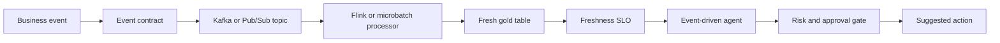
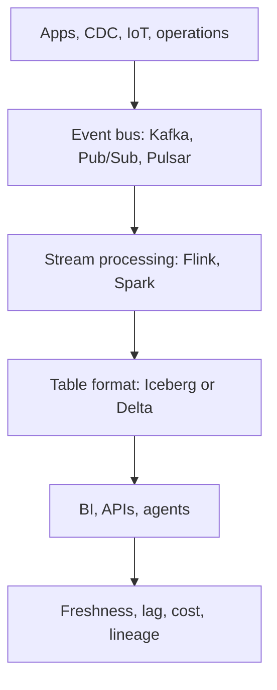
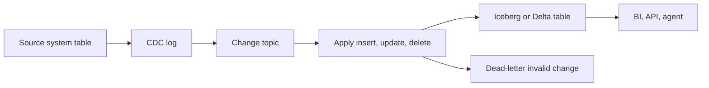
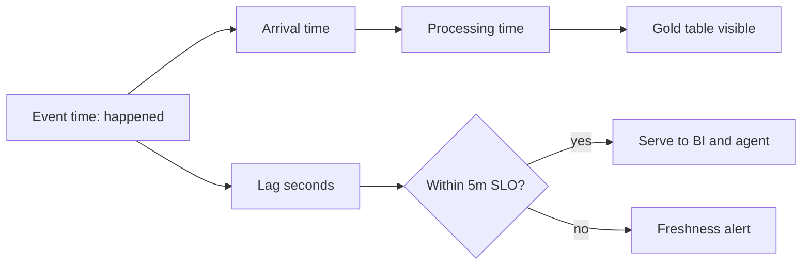
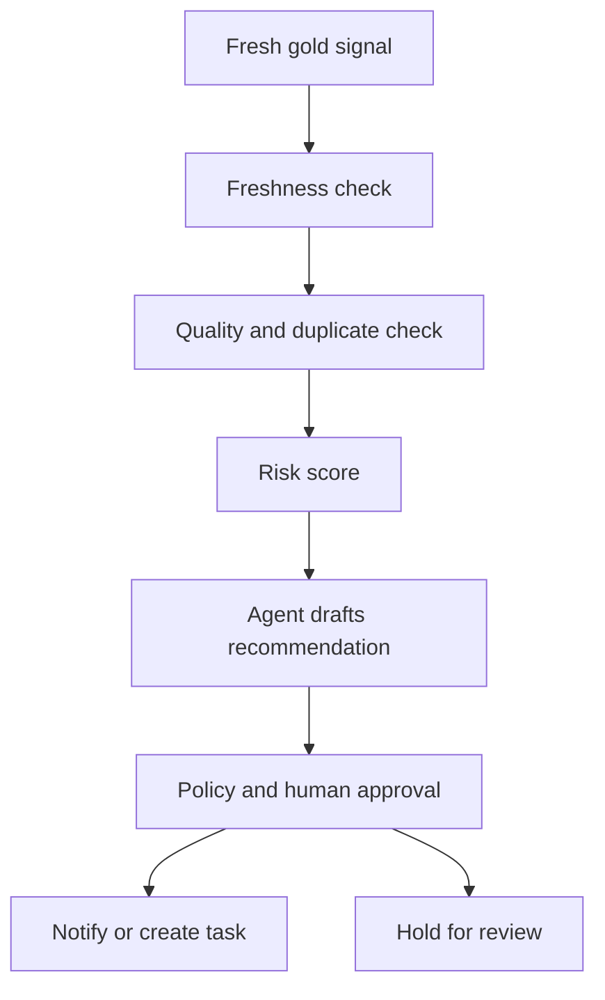
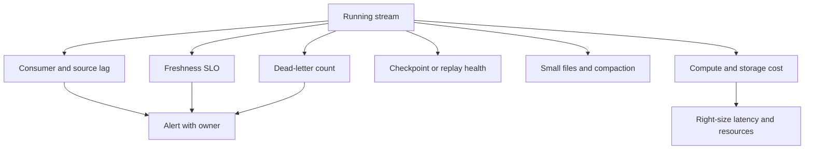
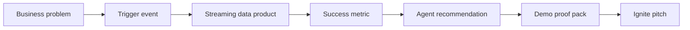

# Day 6 - Real-Time And Streaming Data Products - Learner Revision, Diagrams And Study Pack

Share this Markdown with learners after class. It is designed for revision, redraw practice, hands-on repeat practice and interview-style explanation. It contains no private lab credentials, tokens, sandbox URLs or screenshots.

## 1. Today In One Paragraph

Today moved the class from periodic data products to real-time and near-real-time products. We built the mental model of event source, Kafka/Pub/Sub topic, Flink/Spark or micro-batch processor, Iceberg/Delta/BigQuery table, freshness SLO, dead-letter/replay path, event-driven agent gate and hackathon proof. The key discipline was shift-left streaming governance: validate the event contract, measure lag, control duplicates and late events, monitor freshness and cost, and let AI act only from a governed signal.

**Memory line:** Fast wrong data is worse than slow honest data.

## 2. Course Syllabus Outcomes Covered

- Stand up or simulate a streaming path from event source to continuously fresh data product.
- Explain Kafka/PubSub topics, Flink/stateful processing, CDC and lakehouse table materialisation in plain English.
- Distinguish event time, processing time, lag, lateness, watermark thinking and freshness SLOs.
- Apply shift-left quality and governance before events land in the gold product.
- Explain dead-letter, replay, idempotency and exactly-once/duplicate-control tradeoffs.
- Feed real-time context to an event-driven agent while keeping approval and policy gates in place.
- Lock a hackathon problem, success metric, proof plan and demo promise.

## 3. Dataset, Tools And Saved Evidence

| Item | What to remember |
|---|---|
| Demo lane | `Logistics` |
| Primary dataset | `Miscellaneous/Delivery_Logistics.csv` |
| Fallback dataset | `Miscellaneous/Delivery truck trip data.xlsx` |
| VM evidence folder | `Persistent_Folder/day-06-evidence` |
| Main Markdown artifact | `day-06-streaming-slo-evidence.md` |
| Notebook/proof file | `day-06-event-stream-freshness.ipynb` |
| Core classroom implementation | VM micro-batch stream simulation; Kafka/Flink if stable |
| Databricks translation | Structured Streaming plus Delta table/checkpoint pattern |
| GCP translation | Pub/Sub, Cloud Run functions or Cloud Functions, Dataflow/Flink-style processing, BigQuery Storage Write API, Cloud Logging and Monitoring |
| AI assistants | Codex or Claude Code may draft, explain or inspect. Learners must review before accepting. |

## 3A. Lab Tool Coverage Map

The Day 6 environment is intentionally tool-rich. The core learning path is Python/Jupyter plus the evidence artifact. The instructor can demo the full chain; learners should complete the core path and at least one extension.

| Tool | Day 6 practical use | Evidence to save |
|---|---|---|
| VS Code, Codex, Claude extension | Write the artifact, inspect AI drafts and correct assumptions | Prompt, accepted/rejected AI note |
| Python 3.12 and Jupyter | Simulate events, calculate lag, split gold/dead-letter rows | Notebook output |
| Kafka `localhost:9092` | Produce and consume shipment events | Topic name and consumed event |
| Flink UI `http://localhost:8083` | Explain event-time, state, checkpoint and job responsibility | UI screenshot note or responsibility note |
| Spark UI `http://localhost:8080` / `8081` | Show lakehouse compute responsibility | UI screenshot note or responsibility note |
| Iceberg / Delta / PySpark lake | Explain streaming table materialisation and compaction | Table-target design note |
| Postgres | Store agent/action audit rows | `SELECT` output or audit table note |
| Redis | Cache latest shipment freshness state | `SET`/`GET` output |
| dbt | Define quality tests for the served gold table | Test names and expected assertions |
| Airflow UI `http://localhost:8085` | Schedule recurring freshness/replay checks | DAG responsibility note |
| Qdrant or LanceDB | Retrieve policy/context for the agent | Retrieval responsibility note |
| Neo4j `http://localhost:7474` | Show shipment-carrier-customer-policy graph | Cypher result or graph note |
| LangGraph or CrewAI | Route the event-agent workflow through checks and approval | Agent workflow note |
| Prometheus `http://localhost:9090` | Inspect/query metrics surface | Metric selected for alerting |
| Grafana `http://localhost:3000` | Dashboard freshness, lag, dead-letter and cost | Dashboard metric table |
| gcloud CLI | Translate VM proof to managed GCP services | Service mapping |
| Chrome/Firefox and LibreOffice | Review UIs and export final evidence | Browser proof or exported pack note |

## 4. Practical Repeat Steps

1. Create `Persistent_Folder/day-06-evidence`.
2. Create `day-06-streaming-slo-evidence.md`.
3. Write the event contract with `event_id`, `shipment_id`, `event_type`, `event_time`, `processing_time`, `source_system` and payload/status.
4. Create `day-06-event-stream-freshness.ipynb`.
5. Simulate valid, duplicate, late and invalid shipment events.
6. Compute `lag_seconds = processing_time - event_time`.
7. Split valid gold events from dead-letter events.
8. Measure the freshness SLO: for example, `95 percent of valid events available within 5 minutes`.
9. Create an event-driven agent signal from the gold table only, not from raw event noise.
10. Write the approval gate: what the agent may draft and what it may not auto-execute.
11. Add reliability notes for idempotency, replay, dead-letter and exactly-once/duplicate control.
12. Add cost notes for latency target, compute sizing, compaction and tiering.
13. Map the VM proof to GCP or Databricks services.
14. Lock the hackathon problem statement, trigger event, success metric, demo promise and team roles.
15. Complete peer review and ship review.

## 4A. Step-By-Step Rich Practicals

Use these after class to repeat or extend the instructor demo. If a service is blocked, write `fallback` in the tool coverage passport and keep the evidence structure.

### Practical 1 - Kafka Event Bus Proof

```bash
systemctl is-active kafka || true
/opt/kafka/bin/kafka-topics.sh --bootstrap-server localhost:9092 \
  --create --if-not-exists \
  --topic day6.shipment.events \
  --partitions 1 \
  --replication-factor 1

cat <<'EVENTS' | /opt/kafka/bin/kafka-console-producer.sh \
  --bootstrap-server localhost:9092 \
  --topic day6.shipment.events
{"event_id":"EVT-101","shipment_id":"SHIP-2001","event_type":"pickup","event_time":"2026-07-31T10:00:00Z","status":"picked_up"}
{"event_id":"EVT-102","shipment_id":"SHIP-2001","event_type":"delay","event_time":"2026-07-31T10:08:00Z","status":"weather_delay"}
EVENTS

/opt/kafka/bin/kafka-console-consumer.sh \
  --bootstrap-server localhost:9092 \
  --topic day6.shipment.events \
  --from-beginning \
  --max-messages 2
```

Evidence: topic name plus one consumed JSON event.

### Practical 2 - Python/Jupyter Freshness And Dead-Letter Proof

Repeat the notebook from class. Save:

- gold rows,
- dead-letter rows,
- `freshness_percent`,
- `worst_lag_seconds`,
- one breach or no-breach sentence.

Evidence: copied notebook output in `## 3. Stream To Table Proof`.

### Practical 3 - Postgres Audit And Redis Freshness Cache

```bash
psql -U labuser -d labuser_db <<'SQL'
CREATE TABLE IF NOT EXISTS day6_stream_audit (
  event_id text,
  shipment_id text,
  signal text,
  recommendation text,
  auto_execute boolean,
  created_at timestamptz DEFAULT now()
);

INSERT INTO day6_stream_audit(event_id, shipment_id, signal, recommendation, auto_execute)
VALUES ('EVT-102', 'SHIP-2001', 'delay_within_freshness_slo', 'draft dispatcher review task', false);

SELECT event_id, shipment_id, signal, auto_execute FROM day6_stream_audit ORDER BY created_at DESC LIMIT 3;
SQL

redis-cli -p 6379 SET day6:shipment:SHIP-2001:freshness_status draft_only
redis-cli -p 6379 GET day6:shipment:SHIP-2001:freshness_status
```

Evidence: Postgres audit row and Redis value.

### Practical 4 - Neo4j Graph Context Proof

Open `http://localhost:7474/` and run:

```cypher
MERGE (s:Shipment {id:'SHIP-2001'})
MERGE (c:Carrier {name:'Carrier Demo'})
MERGE (u:Customer {name:'Retail Customer'})
MERGE (p:Policy {name:'Delay response policy'})
MERGE (s)-[:HANDLED_BY]->(c)
MERGE (s)-[:IMPACTS]->(u)
MERGE (s)-[:GOVERNED_BY]->(p)
RETURN s, c, u, p
```

Evidence: graph result or written graph path.

### Practical 5 - Agent Workflow And Retrieval Design

Document this workflow with LangGraph or CrewAI. Running it is optional; explaining the governed path is required.

```text
Event signal -> freshness check -> quality check -> retrieve policy from Qdrant/LanceDB -> graph impact check in Neo4j -> draft recommendation -> approval gate -> audit row
```

Evidence: workflow note and one explicit blocked action.

### Practical 6 - Observability And Orchestration Proof

Open:

```text
Prometheus: http://localhost:9090
Grafana: http://localhost:3000
Airflow: http://localhost:8085
```

Record:

- one metric to alert on,
- who owns the alert,
- what Airflow would schedule,
- what dbt test would protect the gold table.

Evidence: dashboard metric table and orchestration note.

## 5. Expected Artifact Sections

Your `day-06-streaming-slo-evidence.md` should contain these sections:

| Section | What it proves |
|---|---|
| Lane And Dataset | The data path is explicit and reviewable. |
| Event Contract | The stream has required fields, keys and event-time meaning. |
| Stream To Table Proof | Events became a queryable gold product or simulation output. |
| Freshness SLO | The product has a measurable freshness promise. |
| Event-Driven Agent Gate | AI uses governed signals and stays behind approval. |
| Reliability, Replay And Cost | Duplicate, late, failed and expensive stream behavior is controlled. |
| GCP Translation | The local proof maps to managed cloud responsibilities. |
| Tool Coverage Passport | The learner knows which lab tools were seen, run or used as fallback. |
| Hackathon Problem Statement Lock | The team has a measurable build target. |
| Exit Ticket | The learner can state proof, risk and next question. |

## 6. Key Concepts In Simple Words

| Concept | Simple explanation |
|---|---|
| Streaming data product | A data product kept fresh by events rather than only scheduled batch loads. |
| Event | A thing that happened in the business, such as shipment delayed or payment posted. |
| Topic | A named event stream that decouples producers from consumers. |
| Producer | The system that publishes events. |
| Consumer | The system that reads events. |
| CDC | Change data capture: turning database inserts, updates and deletes into events. |
| Event time | The time the business event happened. |
| Processing time | The time the system processed the event. |
| Lag | Delay between event time and processing/serving time. |
| Watermark | A processor's signal that event time has advanced far enough to close or evaluate a window. |
| Freshness SLO | A measurable promise for how quickly valid data becomes usable. |
| Late event | An event that arrives after the expected processing window. |
| Dead-letter queue | A place to isolate events that cannot be safely processed. |
| Replay | Reprocessing past events to rebuild or correct state. |
| Idempotency key | A key that lets repeated processing avoid duplicate output. |
| Exactly-once thinking | Designing broker, processor, sink and application keys so events are not lost or duplicated in the result. |
| Streaming table | A lakehouse or warehouse table continuously or frequently updated by events. |
| Small-file problem | Too many tiny files from low-latency writes, causing query performance and cost pain. |
| Event-driven agent | An agent that reacts to a governed signal produced by the data path. |
| Agent gate | The approval or policy boundary before an agent-created recommendation becomes action. |
| Hackathon metric | The measurable result that proves the team built something valuable. |

## 7. Diagrams To Redraw And Revise

Redraw these diagrams by hand or in Mermaid. For each arrow, say what responsibility moves from one box to the next and what evidence proves the step.

### Diagram 1 - Streaming Data Product Control Path

Revision prompt: name the box where governance moves left.



### Diagram 2 - Tool Responsibility Map

Revision prompt: explain the job of each layer without naming a vendor first.



### Diagram 3 - CDC To Lakehouse Table

Revision prompt: what can go wrong with inserts, updates and deletes?



### Diagram 4 - Event Time And Freshness SLO

Revision prompt: explain why event time and processing time are not the same.



### Diagram 5 - Event Agent Gate

Revision prompt: what can the agent draft, and what must stay behind approval?



### Diagram 6 - Streaming Operations Control Panel

Revision prompt: choose the first metric you would alert on and defend the choice.



### Diagram 7 - Hackathon Lock Path

Revision prompt: identify the weakest part of your team's hackathon idea.



## 8. Industry Use Cases To Remember

| Industry | Real-time product | What streams | Key control |
|---|---|---|---|
| Banking | Real-time fraud stream | Card or account transaction events | Duplicate-safe processing, fraud threshold and audit |
| Supply chain and logistics | Live control tower | Shipment, carrier, GPS and exception events | Freshness SLO, late-event handling and approval |
| Insurance | Real-time claims events | Claim status changes through CDC | CDC lineage, PII control and workflow gate |
| Finance and accounts | Streaming cash position | Treasury, invoice, payment and bank events | Reconciliation, approval and owner review |

## 9. Common Misconceptions

| Misconception | Better understanding | Proof needed |
|---|---|---|
| Streaming means batch but faster | Streaming means events, state, time, replay and continuous freshness | Event path plus lag/freshness output |
| Latest event is always the truth | Latest by processing time can still be wrong if event time is late or out of order | Event time vs processing time comparison |
| Exactly-once is automatic | It requires compatible broker, processor, sink and application-key design | Idempotency or transactional/checkpoint note |
| Bad events can be ignored | Bad events need a dead-letter or review path | Dead-letter count or table |
| AI can act immediately on a stream | AI should use governed signals and stay behind policy/approval gates | Agent gate row |
| Sub-second is always better | Latency target should match business value and cost | Cost/SLO tradeoff note |

## 10. Self-Quiz

| # | Question | Expected answer shape |
|---:|---|---|
| 1 | What is the main artifact for today? | Name `day-06-streaming-slo-evidence.md` and `Persistent_Folder/day-06-evidence`. |
| 2 | What is the difference between event time and processing time? | Event time is when it happened; processing time is when the system handled it. |
| 3 | What is a freshness SLO? | A measurable promise for how fast valid data becomes usable. |
| 4 | Why do streams need dead-letter handling? | Invalid or unsafe events need isolation and review instead of silent failure. |
| 5 | What is idempotency used for? | To make retries/replays avoid duplicate business output. |
| 6 | Why should an event-driven agent read a gold signal instead of raw events? | The gold signal has contract, quality, deduplication, freshness and meaning applied. |
| 7 | What is the Day 6 hackathon output? | Locked problem, trigger event, success metric, demo promise and roles. |
| 8 | What is the main cost-control lesson? | Choose the latency target intentionally and plan compaction/tiering. |

## 11. Practice Before The Next Class

Spend 20-30 minutes improving the saved artifact:

1. Add one stronger stream-to-table proof line.
2. Add one clearer event contract field or example value.
3. Add one dead-letter or replay example.
4. Add one freshness SLO calculation or breach note.
5. Sharpen your hackathon success metric so it can be measured during a demo.
6. Add one honest limitation: what the classroom proof does not prove yet.

## 12. Shareable Checklist

- [ ] My artifact is saved in `Persistent_Folder/day-06-evidence`.
- [ ] My artifact names the dataset or fallback dataset.
- [ ] My artifact includes an event contract.
- [ ] My artifact includes a stream-to-table or micro-batch proof.
- [ ] My artifact includes a freshness SLO and lag calculation.
- [ ] My artifact includes a dead-letter or duplicate-control note.
- [ ] My artifact includes an event-driven agent gate.
- [ ] My artifact includes reliability, replay and cost notes.
- [ ] My artifact includes the tool coverage passport.
- [ ] My artifact includes the GCP or Databricks translation.
- [ ] My artifact includes the hackathon problem statement lock.
- [ ] My artifact does not expose secrets, tokens, private URLs or credentials.

## 13. Further Study Links

Use these for follow-up reading. Prefer official documentation when tool behavior matters.

- [Apache Kafka documentation](https://kafka.apache.org/documentation/)
- [Confluent Kafka delivery semantics](https://docs.confluent.io/kafka/design/delivery-semantics.html)
- [Apache Flink timely stream processing](https://nightlies.apache.org/flink/flink-docs-stable/docs/concepts/time/)
- [Apache Flink checkpointing](https://nightlies.apache.org/flink/flink-docs-stable/docs/dev/datastream/fault-tolerance/checkpointing/)
- [Apache Iceberg Flink writes](https://iceberg.apache.org/docs/latest/flink-writes/)
- [Databricks Structured Streaming with Delta Lake](https://docs.databricks.com/aws/en/structured-streaming/delta-lake)
- [dbt microbatch incremental models](https://docs.getdbt.com/docs/build/incremental-microbatch)
- [Google Pub/Sub overview](https://docs.cloud.google.com/pubsub/docs/overview)
- [Cloud Run Pub/Sub triggers](https://docs.cloud.google.com/run/docs/triggering/pubsub-triggers)
- [BigQuery Storage Write API](https://docs.cloud.google.com/bigquery/docs/write-api-grpc)
- [BigQuery continuous queries](https://docs.cloud.google.com/bigquery/docs/continuous-queries-introduction)

## 14. Bridge To The Next Day

Tomorrow should not restart from zero. Bring forward today's saved artifact, strongest streaming proof, weakest reliability note, hackathon success metric and one question. The next class builds on this evidence.
