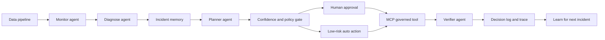
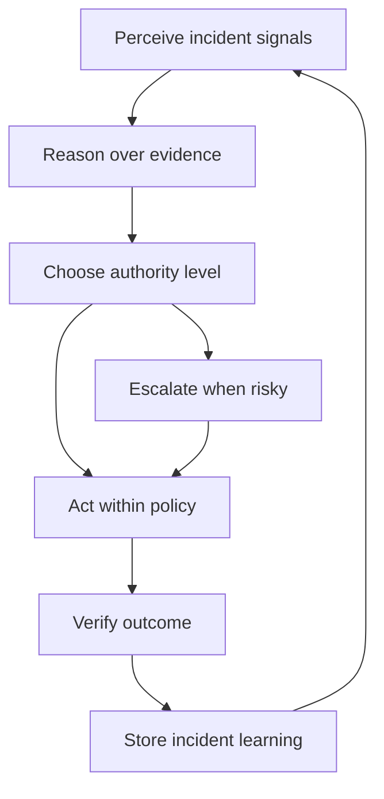
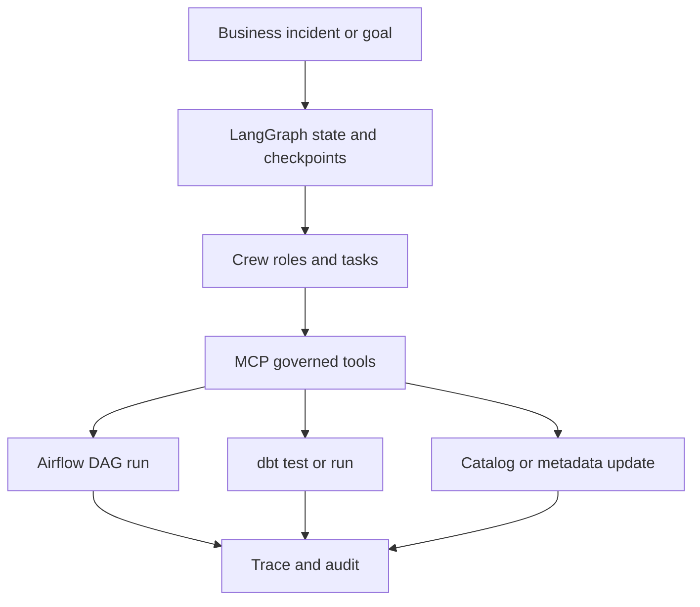
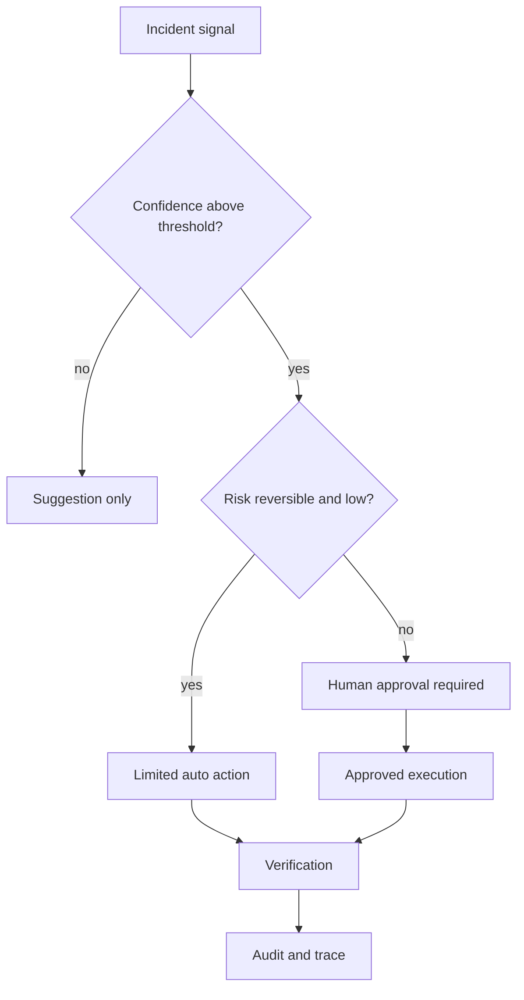
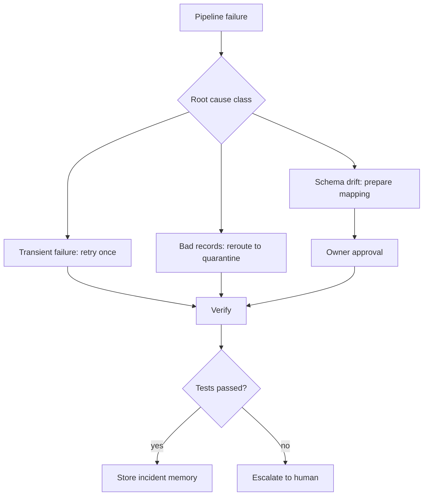
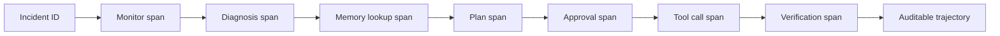
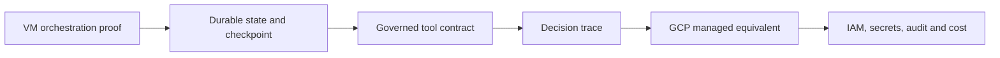

# Day 7 - Advanced Agentic Data Orchestration And Autonomous Pipelines - Learner Revision, Diagrams And Study Pack

Share this Markdown with learners after class. It is designed for revision, redraw practice, hands-on repeat practice and interview-style explanation. It contains no private lab credentials, tokens, sandbox URLs or screenshots.

## 1. Today In One Paragraph

Today moved the class from real-time data products to a governed autonomous orchestration layer over the data value chain. We built the mental model of planner, monitor, diagnoser, fixer, verifier, human approver, tool boundary, checkpoint, incident memory, trace and audit. The key discipline was graduated autonomy: agents may observe, suggest, prepare and sometimes run low-risk reversible actions, but risky or irreversible actions need confidence thresholds, approval, idempotency, rollback and verification.

**Memory line:** Autonomy is a dial, not a switch.

## 2. Course Syllabus Outcomes Covered

- Compose a multi-agent orchestration layer over a data value chain.
- Explain the `Perceive -> Reason -> Act -> Learn` loop for autonomous pipelines.
- Design a LangGraph-style state graph with checkpoints and human-in-the-loop pause/resume.
- Separate agent roles: planner, monitor, diagnoser, fixer, verifier and human approver.
- Use MCP-style governed tools for Airflow, dbt and catalog actions.
- Run a self-healing proof with retry, reroute or schema-fix decisioning.
- Add confidence thresholds, escalation paths, audit logs and approval gates.
- Store incident memory with both the past fix and the risk of applying it.
- Trace an agent decision trajectory end-to-end.
- Explain why production autonomy must start in suggestion mode and earn authority.

## 3. Dataset, Tools And Saved Evidence

| Item | What to remember |
|---|---|
| Demo lane | `Insurance` |
| Primary dataset | `Insurance/Insurance Claims Fraud Data/Insurance Claims Fraud Data.zip` |
| Fallback lane | `Banking` |
| Fallback artifact | Synthetic claims-feed schema drift in notebook |
| VM evidence folder | `Persistent_Folder/day-07-evidence` |
| Main Markdown artifact | `day-07-agentic-orchestration-evidence.md` |
| Notebook/proof file | `day-07-self-healing-orchestrator.ipynb` |
| Core classroom implementation | Python/Jupyter state-machine simulation; LangGraph/CrewAI mapping if stable |
| GCP translation | Cloud Run, Workflows or Composer/Airflow, Secret Manager, Firestore or Postgres state, Logging/Trace/Monitoring |
| AI assistants | Codex or Claude Code may draft, explain or inspect. Learners must review before accepting. |

## 3A. Lab Tool Coverage Map

The Day 7 environment is intentionally tool-rich. The core learner path is Python/Jupyter plus the evidence artifact. The instructor can demo the full chain; learners should complete the core path and at least one extension.

| Tool | Day 7 practical use | Evidence to save |
|---|---|---|
| VS Code, Codex, Claude extension | Write the artifact, inspect AI drafts and correct assumptions | Prompt, accepted/rejected AI note |
| Python 3.12 and Jupyter | Simulate monitor, diagnose, plan, approval, repair and verify states | Notebook output and final state |
| LangGraph | Explain state graph, checkpoints, interrupts and resume | State graph diagram or mapping |
| CrewAI | Explain crew roles and specialist agents | Role/task table |
| MCP | Govern tool calls with schemas, permissions and audit | Tool contract table |
| Airflow | Trigger or inspect DAG run as an approved tool action | DAG/tool boundary note |
| dbt | Use data tests as verification evidence | Test name and expected assertion |
| Postgres | Store decision, approval and trace audit rows | `SELECT` output or table design |
| Redis | Store idempotency key, retry lock or latest incident state | `SET`/`GET` output or design |
| Qdrant or LanceDB | Retrieve similar incident memory | Memory match note |
| Mem0 / MemGPT | Discuss persistent agent memory | Memory safety note |
| Neo4j | Show incident-to-dataset-to-owner-to-downstream impact graph | Cypher result or graph note |
| Prometheus / Grafana | Track incident and agent metrics | Metric selected for alerting |
| gcloud CLI | Translate VM proof to GCP managed services | Service mapping |
| LibreOffice | Export final evidence pack | Export note |

## 3B. Applied Labs And Tool Practicals Index

Use this index to find the Day 7 practicals quickly. The details are in Section 4A.

| Practical | Tools | What you produce |
|---|---|---|
| Practical 1 - Self-healing orchestrator | Python 3.12, Jupyter | Blocked and approved orchestration traces |
| Practical 2 - Decision log and idempotency | Postgres, Redis | Audit row and idempotency key |
| Practical 3 - Governed tool contract | MCP pattern, Airflow REST, dbt, catalog | Safe tool-call contract table |
| Practical 4 - Incident memory | Qdrant/LanceDB concept, Mem0/MemGPT concept, Markdown fallback | Past incident memory with fix and risk |
| Practical 5 - Impact graph | Neo4j or Mermaid fallback | Incident-to-dataset-to-owner-to-downstream graph |
| Practical 6 - Observability | Prometheus/Grafana concept, OpenTelemetry/LangSmith concept | Agent metrics and trajectory trace |
| Practical 7 - GCP translation | gcloud CLI concept, Cloud Run, Workflows/Composer, Secret Manager, Cloud Trace | Managed-service mapping |

Minimum evidence expected: artifact, notebook output, approval-blocked trace, governed tool contract, incident memory, one tool proof or fallback note, and GCP translation.

## 4. Practical Repeat Steps

1. Create `Persistent_Folder/day-07-evidence`.
2. Create `day-07-agentic-orchestration-evidence.md`.
3. Define the incident: claims feed schema drift, freshness breach or failed data test.
4. Define separate agent roles and a `must not do` column for each role.
5. Create the graduated authority table: `observe_only`, `suggestion_only`, `approval_required`, `limited_auto`, `approved_execution`.
6. Create `day-07-self-healing-orchestrator.ipynb`.
7. Simulate the incident state with expected columns, observed columns, freshness age and downstream impact.
8. Run monitor, diagnoser, memory lookup, planner, human approval, fixer and verifier steps.
9. Run once with approval blocked and once with approval granted.
10. Copy the final state and trace rows into the artifact.
11. Add governed tool contracts for Airflow, dbt and catalog update.
12. Add a repair decision table: retry, reroute, schema mapping.
13. Add an incident memory entry that stores risk as well as the fix.
14. Add an agent trajectory trace with evidence, decision, tool call and outcome.
15. Map the proof to GCP managed services.
16. Add one honest limitation and one next improvement.

## 4A. Step-By-Step Rich Practicals

Use these after class to repeat or extend the instructor demo. If a service is blocked, write `fallback` in the tool coverage passport and keep the evidence structure.

### Practical 1 - Python Self-Healing Orchestrator Proof

Repeat the notebook from class. Run it twice:

- Run 1: `approved=False`
- Run 2: `approved=True`

Evidence to save:

- incident ID,
- proposed action,
- confidence value,
- authority level,
- approval decision,
- final state,
- at least three trace rows.

Expected learning: the system may diagnose and propose without approval, but schema-changing repair remains blocked until the human approval step changes.

### Practical 2 - Postgres Decision Log And Redis Idempotency Key

Use Postgres and Redis if available.

```bash
psql -U labuser -d labuser_db <<'SQL'
CREATE TABLE IF NOT EXISTS day7_agent_decision_log (
  incident_id text,
  agent text,
  action text,
  authority text,
  decision text,
  evidence text,
  created_at timestamptz DEFAULT now()
);

INSERT INTO day7_agent_decision_log
  (incident_id, agent, action, authority, decision, evidence)
VALUES
  ('INC-CLAIMS-007', 'planner', 'propose_schema_mapping', 'approval_required', 'wait_for_owner', 'claim_amount missing; amount_paid present');

SELECT incident_id, agent, authority, decision
FROM day7_agent_decision_log
ORDER BY created_at DESC
LIMIT 5;
SQL

redis-cli -p 6379 SET day7:INC-CLAIMS-007:idempotency schema_mapping:INC-CLAIMS-007
redis-cli -p 6379 GET day7:INC-CLAIMS-007:idempotency
```

Evidence: one decision-log row and one idempotency value.

### Practical 3 - Governed Tool Contract

Document tool calls before executing or simulating them.

```markdown
| Tool | Request | Required parameters | Approval rule | Verification |
| --- | --- | --- | --- | --- |
| Airflow REST | trigger approved retry | dag_id, run_id, incident_id | low-risk retry only | DAG success |
| dbt | run named tests | model, test_name, incident_id | allowed for verification | zero critical failures |
| Catalog | update schema note | dataset, owner, reason | owner approval required | audit row exists |
```

Evidence: completed contract table plus one blocked action.

### Practical 4 - Incident Memory

Add a memory entry with both useful fix and warning.

```markdown
| Field | Value |
| --- | --- |
| Incident pattern | required column missing after source feed change |
| Past fix | map renamed field in staging transform |
| Why it may apply | candidate replacement column exists |
| Why it may not apply | business meaning may differ |
| Required control | owner approval before schema-changing action |
| Verification | required-column and duplicate-count tests |
```

Evidence: memory entry plus one sentence explaining why memory is not truth.

### Practical 5 - Neo4j Impact Graph

If Neo4j is available, create a small impact graph. If it is blocked, redraw the Mermaid diagram in the artifact.

```cypher
MERGE (i:Incident {id:'INC-CLAIMS-007'})
MERGE (d:Dataset {name:'insurance_claims_feed'})
MERGE (o:Owner {name:'claims_data_owner'})
MERGE (m:Model {name:'fraud_feature_table'})
MERGE (b:Dashboard {name:'claims_dashboard'})
MERGE (i)-[:AFFECTS]->(d)
MERGE (d)-[:OWNED_BY]->(o)
MERGE (d)-[:FEEDS]->(m)
MERGE (d)-[:FEEDS]->(b)
RETURN i, d, o, m, b
```

Evidence: graph result or written impact path.

### Practical 6 - Observability And Trace Metrics

Track these as the minimum agent observability set:

| Metric | Why it matters |
|---|---|
| `agent_run_count` | How many orchestration attempts occurred |
| `agent_tool_call_count` | How often agents invoked tools |
| `agent_approval_required_count` | How much work is gated by humans |
| `agent_repair_success_count` | Whether repairs are actually working |
| `agent_repair_failed_count` | Whether autonomy is increasing risk |
| `incident_time_to_detect` | How quickly incidents are noticed |
| `incident_time_to_recover` | How quickly incidents close |
| `agent_cost_estimate` | Whether multi-agent routing is economically reasonable |

Evidence: one metric selected for dashboarding and one trace table row.

### Practical 7 - GCP Translation

Translate the VM proof into managed cloud responsibilities. Do not claim deployment unless you actually deployed it.

```markdown
| Responsibility | GCP service candidate | What it owns |
| --- | --- | --- |
| Orchestrator runtime | Cloud Run or Workflows | Runs the state machine or orchestration service |
| Scheduled pipeline control | Cloud Composer / Airflow | Runs existing pipeline DAGs |
| Durable state/checkpoint | Firestore or Postgres/AlloyDB | Stores incident state and resume data |
| Secrets | Secret Manager | Stores API tokens and service credentials |
| Tool execution audit | Cloud Logging | Records tool request, approval and result |
| Trace | Cloud Trace or OpenTelemetry collector | Shows agent trajectory spans |
| Metrics/dashboard | Cloud Monitoring | Tracks repair success, failures, cost and recovery time |
```

Evidence: one completed GCP service mapping and one sentence naming the security boundary.

### Practical 8 - Industry Ship Statement

Choose one industry lens and write a complete ship statement.

```markdown
Chosen industry:
Incident:
Autonomous capability:
Approval boundary:
Tool used:
Trace evidence:
Production risk:
Ship statement:
```

Example:

```markdown
Chosen industry: Insurance
Incident: claims feed schema drift
Autonomous capability: diagnose missing field, retrieve similar incident and propose schema mapping
Approval boundary: owner approval required before schema mapping
Tool used: Python trace, Qdrant memory concept and governed Airflow/dbt contract
Trace evidence: blocked and approved JSON traces
Production risk: wrong field meaning could corrupt fraud features
Ship statement: We shipped a governed self-healing claims orchestration that blocks schema repair until owner approval and verifies before close.
```

Evidence: one industry-specific ship statement with incident, control and proof.

## 5. Expected Artifact Sections

Your `day-07-agentic-orchestration-evidence.md` should contain these sections:

| Section | What it proves |
|---|---|
| Incident | The business failure and impact are explicit. |
| Agent Roles | Duties are separated and dangerous overlaps are blocked. |
| Graduated Authority | Autonomy levels are visible and controlled. |
| Decision Log | Agent choices can be reviewed later. |
| Tool Boundary | Airflow/dbt/catalog actions are governed, not unrestricted. |
| Incident Memory | Past incidents help diagnosis without replacing evidence. |
| Orchestration Graph | The workflow can pause, resume and checkpoint. |
| Repair Decision | Retry, reroute and schema-fix actions are risk-ranked. |
| Agent Trajectory Trace | The why behind each decision is visible. |
| Cloud Translation | VM proof maps to managed cloud responsibilities. |
| Honest Limitation | The demo does not overclaim production autonomy. |
| Tool Coverage Passport | Learners know which tools were seen, run or treated as fallback. |

## 6. Key Concepts In Simple Words

| Concept | Simple explanation |
|---|---|
| Agentic orchestration | A controlled workflow where agents reason over incidents and coordinate safe action. |
| Autonomous pipeline | A pipeline that can detect, diagnose and sometimes repair problems under policy. |
| Self-healing | Detecting a failure and taking a verified recovery path such as retry, reroute or approved repair. |
| Planner | The agent role that proposes the next path. |
| Monitor | The role that watches freshness, failures and anomalies. |
| Diagnoser | The role that explains likely cause using evidence. |
| Fixer | The role that prepares or executes allowed remediation. |
| Verifier | The role that checks whether the action worked. |
| Human-in-the-loop | A human approval step before risky or irreversible action. |
| Checkpoint | Durable saved state that lets a graph pause and resume without losing evidence. |
| Interrupt | A planned pause in graph execution for human input or external review. |
| MCP tool | A governed tool interface with a name, description, input schema and permission boundary. |
| Confidence threshold | A minimum score or evidence level before authority increases. |
| Idempotency | A design that makes repeated execution safe from duplicate side effects. |
| Rollback | A planned way to undo or recover from a bad repair. |
| Incident memory | Stored knowledge of past failures, fixes, risks and verification outcomes. |
| Agent trace | A step-by-step record of evidence, reasoning, tool calls, approvals and outcomes. |
| A2A / cross-system agents | Agents coordinating across systems and other agents, with controls at each boundary. |

## 7. Diagrams To Redraw And Revise

Redraw these diagrams by hand or in Mermaid. For each arrow, say what responsibility moves from one box to the next and what evidence proves the step.

### Diagram 1 - Autonomous Orchestration Layer

Revision prompt: name the box that prevents a risky repair from executing automatically.



### Diagram 2 - Perceive, Reason, Act, Learn Loop

Revision prompt: explain why `learn` must happen after verification, not before it.



### Diagram 3 - Framework Responsibility Map

Revision prompt: explain the job of LangGraph, CrewAI, MCP, Airflow, dbt and trace/audit without calling any of them magic.



### Diagram 4 - Graduated Autonomy Gate

Revision prompt: name one action that belongs in `limited auto action` and one that belongs in `human approval required`.



### Diagram 5 - Diagnosis And Remediation Path

Revision prompt: explain why schema fixes have a different approval requirement from retries.



### Diagram 6 - Agent Trajectory Observability

Revision prompt: say what the trace explains that a normal pipeline log does not.



### Diagram 7 - VM To GCP Translation Map

Revision prompt: name the managed service that would own orchestration, state, secrets and observability.



## 8. Production Notes And Pitfalls

- Autonomy is a dial. Start in suggestion mode and earn more authority with evidence.
- More agents multiply cost and failure surface. Add specialist agents only when the responsibility needs separation.
- Never let a fixer approve itself.
- Never let an agent write directly to the data path without idempotency, rollback and approval for irreversible actions.
- Memory is a clue, not truth. Store both the fix and the risk.
- A trace must capture why a decision happened, not only what task ran.
- Approval gates must appear before action, not after damage.
- Tool calls should be narrow, typed, permissioned and auditable.
- The demo proves the control pattern; it does not prove production readiness unless security, scale, cost, monitoring and failure handling are implemented end-to-end.

## 9. Industry Use Cases

| Industry | Use case | What makes it safe |
|---|---|---|
| Insurance | Autonomous claims pipeline that recovers from feed failures | Human approval before schema-changing repair |
| Banking | Governed autonomy for a risk pipeline | Confidence threshold, escalation and audit trail |
| Supply Chain and Logistics | Incident memory for recurring shipment or EDI failures | Past fixes linked to current evidence and owner impact |
| Healthcare | Safe automation on clinical data | Reversible actions, no auto-write to sensitive path, full audit |

## 10. Self-Quiz

| # | Question | Expected answer shape |
|---:|---|---|
| 1 | What is the memory line for Day 7? | `Autonomy is a dial, not a switch.` |
| 2 | What are the six core roles in the orchestrator? | Planner, monitor, diagnoser, fixer, verifier, human approver. |
| 3 | What is the difference between self-healing and blind retry? | Self-healing diagnoses, chooses authority, verifies and learns. |
| 4 | Why should schema repair require approval? | It may change business meaning and downstream contracts. |
| 5 | What does a checkpoint protect? | State, evidence and resume/audit capability. |
| 6 | What is an MCP-style tool boundary? | A named, typed, permissioned and auditable tool interface. |
| 7 | What must be stored in incident memory besides the fix? | Risk, applicability, evidence and verification outcome. |
| 8 | What does an agent trace show? | Evidence, reasoning, approval, tool call, cost/latency and result. |
| 9 | What action could be limited-auto? | Low-risk idempotent retry or audited quarantine. |
| 10 | What action should stay human-approved? | Schema change, production write, deletion, PII access or irreversible action. |

## 11. Practice Before The Next Class

Spend 20-30 minutes improving the saved artifact:

1. Add one stronger trace row.
2. Add one clearer approval rule.
3. Add one rollback sentence for the repair plan.
4. Add or redraw one Mermaid diagram from this pack.
5. Add one incident memory record with both a fix and a risk.
6. Add one GCP translation line for state, secrets, orchestration and observability.
7. Add one honest limitation: what your demo does not prove yet.

## 12. Shareable Checklist

- [ ] My artifact is saved in the persistent folder.
- [ ] My artifact names the incident and business impact.
- [ ] My artifact separates agent roles.
- [ ] My artifact names at least two forbidden actions.
- [ ] My artifact includes graduated authority.
- [ ] My artifact includes a confidence threshold.
- [ ] My artifact includes a human approval gate before risky action.
- [ ] My artifact includes idempotency or rollback.
- [ ] My artifact includes a governed tool contract.
- [ ] My artifact includes verification.
- [ ] My artifact includes incident memory with risk.
- [ ] My artifact includes an agent trajectory trace.
- [ ] My artifact includes the GCP translation.
- [ ] My artifact does not expose secrets or private lab access.

## 13. Further Study Links

Use these for follow-up reading. Prefer official documentation when tool behavior matters.

- [LangGraph overview](https://docs.langchain.com/oss/python/langgraph/overview)
- [LangGraph persistence and checkpointers](https://docs.langchain.com/oss/python/langgraph/persistence)
- [LangGraph interrupts for human-in-the-loop](https://docs.langchain.com/oss/python/langgraph/interrupts)
- [CrewAI documentation](https://docs.crewai.com/)
- [Model Context Protocol tools specification](https://modelcontextprotocol.io/specification/2025-06-18/server/tools)
- [Apache Airflow stable REST API](https://airflow.apache.org/docs/apache-airflow/stable/stable-rest-api-ref.html)
- [dbt data tests](https://docs.getdbt.com/docs/build/data-tests)
- [OpenTelemetry traces](https://opentelemetry.io/docs/concepts/signals/traces/)
- [LangSmith observability](https://docs.smith.langchain.com/observability)
- [Google Cloud Workflows](https://cloud.google.com/workflows/docs)
- [Cloud Composer / managed Airflow](https://cloud.google.com/composer/docs)
- [Secret Manager overview](https://cloud.google.com/secret-manager/docs/overview)
- [Cloud Trace overview](https://cloud.google.com/trace/docs/overview)

## 14. Bridge To The Next Day

Tomorrow should not restart from zero. Bring forward today's saved artifact, strongest trace, weakest approval boundary, one incident memory record and one question. Day 8 moves into active metadata, mesh and FinOps; those ideas become more powerful when metadata can influence safe orchestration decisions.
