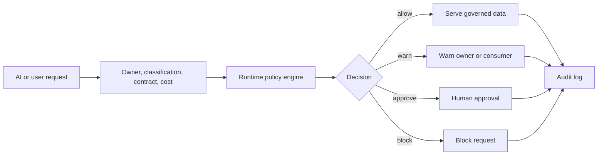
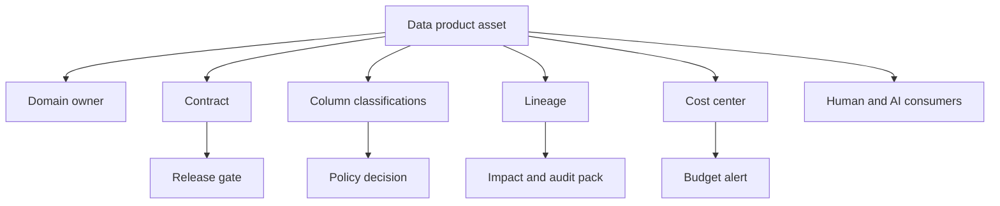
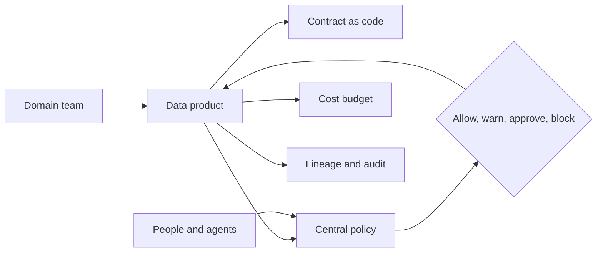
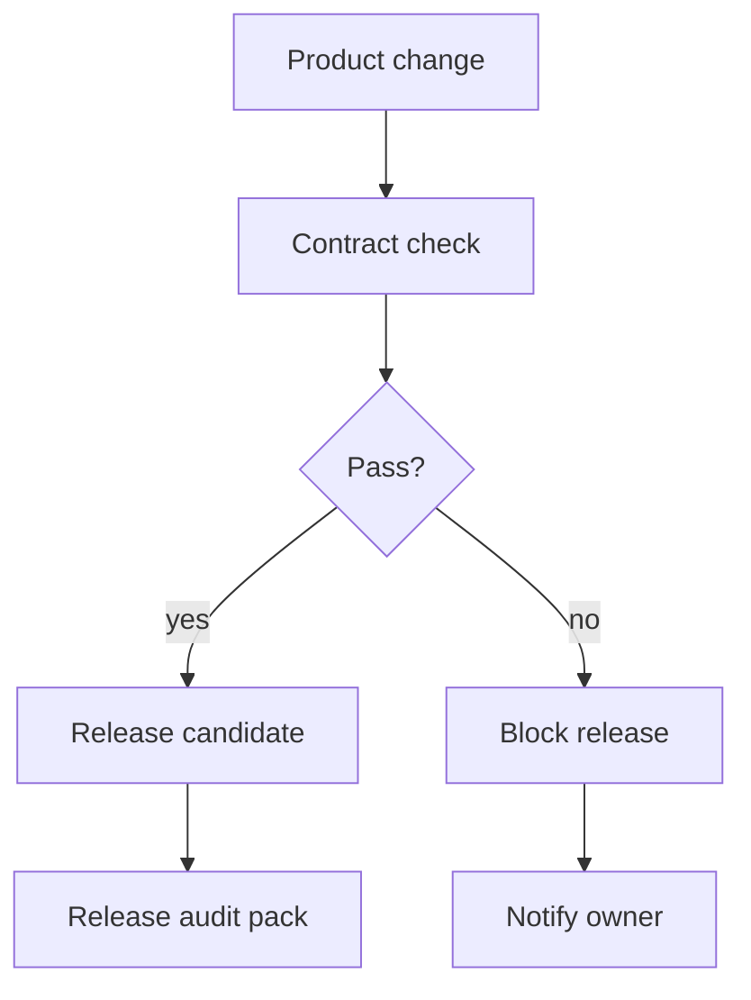
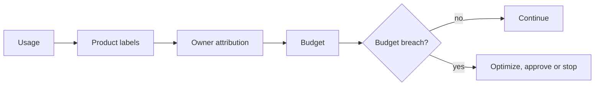
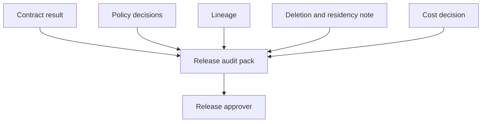

# Day 8 - Advanced Governance, Active Metadata, Data Mesh And FinOps - Learner Revision, Diagrams And Study Pack

Share this Markdown with learners after class. It is designed for revision, redraw practice, hands-on repeat practice and interview-style explanation. It contains no private lab credentials, tokens, sandbox URLs or screenshots.

## 1. Today In One Paragraph

Today moved governance from passive documentation to active control. We built a mesh-ready insurance policy data product with owner, consumers, contract, classifications, runtime AI policy decisions, contract pass/fail checks, release audit pack, FinOps cost model, budget alert, lineage, residency controls and GCP translation. The core idea was that metadata becomes valuable when it changes behavior: allow, warn, approve, block, audit, route, label or alert.

**Memory line:** Metadata is active only when it changes behavior.

## 2. Course Syllabus Outcomes Covered

- Govern with active metadata and runtime controls over what AI and agents may do.
- Publish a mesh-ready data product with owner, contract, consumers, SLA/SLO, policy and central governance standards.
- Build a FinOps cost-per-product model and budget alert.
- Capture EXL SME session insights into capstone actions.
- Explain producer/consumer data contracts and how CI gates block violations.
- Build a release audit pack with lineage, deletion, decision logs and compliance notes.
- Design sovereignty and residency controls for regional and DPDP/GDPR-style constraints.

## 3. Dataset, Tools And Saved Evidence

| Item | What to remember |
|---|---|
| Demo lane | `Insurance` |
| Primary dataset | `Insurance/Insurance/insurance policy data.xlsx` |
| Fallback lane | `Banking` |
| Fallback artifact | Synthetic insurance policy metadata and cost records |
| VM evidence folder | `Persistent_Folder/day-08-evidence` |
| Main Markdown artifact | `day-08-mesh-finops-active-metadata.md` |
| Notebook/proof file | `day-08-active-metadata-cost-model.ipynb` |
| Python fallback | `day-08-active-metadata-governance.py` |
| GCP translation | BigQuery labels, row-level security, policy tags, IAM, Cloud Billing budgets, audit logs, Cloud Monitoring |
| AI assistants | Codex or Claude Code may draft, explain or inspect. Learners must review before accepting. |

## 3A. Lab Tool Coverage Map

The Day 8 environment is intentionally tool-rich. The core learner path is Python/Jupyter plus the evidence artifact. The instructor can demo the full chain; learners should complete the core path and at least one extension.

| Tool | Day 8 practical use | Evidence to save |
|---|---|---|
| VS Code, Codex, Claude extension | Write artifact, review AI drafts and correct assumptions | Prompt or review note |
| Python 3.12 and Jupyter | Runtime policy gate, contract checker, cost model, audit pack | JSON/CSV/Markdown outputs |
| dbt | Contract/test mapping | Mapping table or dbt version note |
| Postgres | Product registry and policy-decision audit rows | `SELECT` output or fallback |
| Redis | Runtime policy/budget cache | `SET`/`GET` output or fallback |
| Neo4j | Product lineage and consumer impact graph | Cypher result or Mermaid fallback |
| Qdrant or LanceDB | Glossary/policy retrieval pattern | Retrieval design note |
| Airflow | Scheduled release gate responsibility | Health check or responsibility note |
| Prometheus / Grafana | Cost and policy-decision metrics | Metric list or dashboard note |
| gcloud CLI | Cloud governance translation | Service mapping |
| LibreOffice | Evidence export or audit pack review | Export note |

## 3B. Applied Labs And Tool Practicals Index

| Practical | Tools | What you produce |
|---|---|---|
| Practical 1 - Evidence and mesh product shell | VS Code, Markdown | Main artifact with product, owner, contract and policy shell |
| Practical 2 - Runtime AI governance gate | Python/Jupyter | `day-08-policy-decisions.json` and allow/approval/warn decisions |
| Practical 3 - Contract as code starter | YAML, Python, dbt concept | `day-08-contract.yml` and passing contract check |
| Practical 4 - SME capture | Markdown | SME insight to capstone action table |
| Practical 5 - Contract violation gate | Python | `day-08-contract-violation-result.json` with release blocked |
| Practical 6 - Federated governance registry | Postgres, Redis, Neo4j | Registry row, runtime cache and lineage path |
| Practical 7 - Release audit pack | Python, Markdown | `day-08-release-audit-pack.md` |
| Practical 8 - FinOps view | Python, CSV, Prometheus/Grafana concept | `day-08-finops-cost-model.csv` and `day-08-finops-view.md` |
| Practical 9 - Sovereignty and industry ship | Markdown, GCP translation | Residency table and industry ship statement |

Minimum evidence expected: artifact, runtime policy JSON, contract YAML, passing contract check, failing violation check, release audit pack, cost CSV/view, one registry/cache/lineage proof or fallback, and GCP translation.

## 4. Practical Repeat Steps

1. Create `Persistent_Folder/day-08-evidence`.
2. Create `day-08-mesh-finops-active-metadata.md`.
3. Define `insurance_policy_product` with owner, domain, consumers and business decision.
4. Add field-level contract metadata: field, type, classification, required flag and notes.
5. Create `day-08-active-metadata-governance.py` or a Jupyter notebook.
6. Run runtime policy decisions for claims ops, AI claims assistant and finance reporting.
7. Save `day-08-policy-decisions.json`.
8. Save `day-08-finops-cost-model.csv`.
9. Create `day-08-contract.yml`.
10. Run `day-08-contract-check.py` and save `day-08-contract-check-result.json`.
11. Run `day-08-contract-violation-check.py` and save `day-08-contract-violation-result.json`.
12. Capture SME insight into capstone actions.
13. Save Postgres/Redis/Neo4j proof or fallback notes.
14. Generate `day-08-release-audit-pack.md`.
15. Generate `day-08-finops-view.md`.
16. Add sovereignty/residency controls.
17. Add GCP translation.
18. Complete peer review and exit ticket.

## 4A. Step-By-Step Rich Practicals

Use these after class to repeat or extend the instructor demo. If a service is blocked, write `fallback` in the tool coverage passport and keep the evidence structure.

### Practical 1 - Runtime AI Governance Gate

Run the script from class or inspect `day-08-policy-decisions.json`.

Evidence to save:

- `REQ-001` human claims access decision,
- `REQ-002` AI raw PII decision,
- `REQ-003` finance reporting decision,
- budget decision.

Expected learning: metadata classification can route an AI request to approval-required instead of blindly serving PII.

### Practical 2 - Contracts As Code

Inspect:

- `day-08-contract.yml`
- `day-08-contract-check-result.json`
- `day-08-contract-violation-result.json`

Evidence to save:

| File | Expected result |
|---|---|
| `day-08-contract-check-result.json` | `release_decision = pass` |
| `day-08-contract-violation-result.json` | `release_decision = block` |

Expected learning: a good release gate proves both pass and fail behavior.

### Practical 3 - Postgres Product Registry And Redis Runtime Cache

If available, repeat. The tables are recreated first, so this works even if you took the fallback path in class or the lab database was reset — a revision step that assumes class-time state will just error out:

```bash
psql -U labuser -d labuser_db <<'SQL'
create table if not exists day8_data_products (
  product_name text, owner text, monthly_budget_usd numeric
);
create table if not exists day8_policy_decisions (
  request_id text, consumer text, decision text,
  reason text, created_at timestamptz default now()
);

insert into day8_data_products (product_name, owner, monthly_budget_usd)
select 'insurance_policy_product', 'insurance_data_owner', 500
where not exists (select 1 from day8_data_products);

insert into day8_policy_decisions (request_id, consumer, decision, reason)
select * from (values
  ('REQ-002','ai_claims_assistant','approval_required','agent requested raw PII'),
  ('REQ-004','global_analytics','block','raw PII cannot leave IN region')
) as v(a,b,c,d)
where not exists (select 1 from day8_policy_decisions);

select product_name, owner, monthly_budget_usd from day8_data_products;
select request_id, consumer, decision from day8_policy_decisions order by created_at desc limit 5;
SQL
```

For Redis, set the key before reading it. A bare `GET` on a key that was never written returns an empty result with exit code 0 — that looks like success and proves nothing:

```bash
redis-cli -p 6379 SET day8:insurance_policy_product:pii_policy "approval_required_for_agents"
redis-cli -p 6379 GET day8:insurance_policy_product:pii_policy
```

Expected: `approval_required_for_agents`. An empty line means the key is missing — record that as a fallback, not as a pass.

Evidence: registry row, decision row and runtime policy cache value. If blocked, write the fallback note in the artifact.

### Practical 4 - Neo4j Lineage

If available, repeat the Cypher graph:

```cypher
MERGE (s:Source {name:'insurance_policy_source'})
MERGE (p:DataProduct {name:'insurance_policy_product'})
MERGE (o:Owner {name:'insurance_data_owner'})
MERGE (a:Agent {name:'ai_claims_assistant'})
MERGE (f:Report {name:'finance_reporting'})
MERGE (s)-[:FEEDS]->(p)
MERGE (p)-[:OWNED_BY]->(o)
MERGE (p)-[:CONSUMED_BY]->(a)
MERGE (p)-[:CONSUMED_BY]->(f)
RETURN s, p, o, a, f
```

Evidence: graph result or written lineage path.

### Practical 5 - Release Audit Pack

Open `day-08-release-audit-pack.md` and check that it contains:

- product and owner,
- contract decision,
- violation decision,
- runtime policy decisions,
- lineage,
- deletion and residency note,
- release decision.

Expected learning: release governance must be inspectable by someone who was not in the notebook.

### Practical 6 - FinOps View

Open:

- `day-08-finops-cost-model.csv`
- `day-08-finops-view.md`

Evidence to save:

- product owner,
- budget,
- current estimated cost,
- budget decision,
- optimization action.

Expected learning: total cloud spend is not enough; product cost needs owner, workload and value.

### Practical 7 - Sovereignty And GCP Translation

Add or inspect:

```markdown
| Responsibility | GCP service/control |
| --- | --- |
| Product labels | BigQuery labels on datasets, tables and jobs |
| Column policy | BigQuery policy tags / data governance tags |
| Row policy | BigQuery row-level security |
| Budget alert | Cloud Billing budgets and alerts |
| Audit log | BigQuery audit logs and Cloud Logging |
| Monitoring | Cloud Monitoring dashboard and alerting |
| Regional control | regional datasets and IAM conditions/policy |
```

Evidence: completed service mapping plus one security boundary sentence.

### Practical 8 - Industry Ship Statement

Choose one:

| Industry | Ship |
|---|---|
| Banking | release audit pack with lineage, deletion and decision logs |
| Insurance | contract-violation gate in the pipeline |
| Finance and Accounts | cost-per-product dashboard and budget alert |
| Healthcare | residency and audited deletion controls |

Use this template:

```markdown
Chosen industry:
Incident/control:
Autonomous/governance action:
Evidence:
Production risk:
Ship statement:
```

## 5. Expected Artifact Sections

Your `day-08-mesh-finops-active-metadata.md` should contain these sections:

| Section | What it proves |
|---|---|
| Data Product | Product, owner, domain, consumers and decision are explicit. |
| Mesh Product Contract | Fields, classifications and required columns are visible. |
| Runtime AI Governance | Metadata produces allow/warn/block/approval-required decisions. |
| Contract Check | Contract pass/fail evidence exists. |
| Lineage And Compliance | Source, product, consumers, deletion and audit path are visible. |
| FinOps | Product cost has owner, budget, current cost and decision. |
| SME Capture | Expert insight became capstone action. |
| Sovereignty And Residency | Regional controls are explicit. |
| GCP Translation | Local proof maps to managed cloud controls. |
| Tool Coverage Passport | Learner knows which tools were seen, run or fallback. |
| Honest Limitation | The class proof does not overclaim production readiness. |

## 6. Key Concepts In Simple Words

| Concept | Simple explanation |
|---|---|
| Active metadata | Metadata that triggers behavior such as allow, warn, block, route, label, audit or alert. |
| Catalog as control plane | A catalog that drives policy decisions, not only search. |
| Runtime AI governance | Controlling what AI and agents can access or do at execution time. |
| Data mesh | Domain-owned data products with shared platform standards. |
| Federated governance | Domains own products; central standards protect the enterprise. |
| Contract as code | A versioned/checkable contract that can block release. |
| Consumer contract | Agreement about what downstream users or agents can expect. |
| Classification | Metadata such as PII, financial, operational or residency. |
| Policy tag | A tag used to enforce or describe column access policy. |
| Row-level security | A rule that limits which rows a user can see. |
| Lineage | A map of source, transformation, product and consumers. |
| Audit pack | Evidence package for release or compliance review. |
| FinOps | Managing cost by product, owner, workload, value and budget. |
| Chargeback/showback | Showing or assigning cost to the owning team or product. |
| Sovereignty/residency | Rules about where data can be stored, processed or accessed. |
| SME capture | Converting expert advice into capstone actions and evidence. |

## 7. Diagrams To Redraw And Revise

Redraw these diagrams by hand or in Mermaid. For each arrow, say what responsibility moves from one box to the next and what evidence proves the step.

### Diagram 1 - Active Metadata Runtime Gate

Revision prompt: name the metadata fields needed before the decision can happen.



### Diagram 2 - Catalog Control Plane

Revision prompt: explain which metadata field drives cost action.



### Diagram 3 - Mesh Product Operating Model

Revision prompt: name what is federated and what remains centralized.



### Diagram 4 - Contract Release Gate

Revision prompt: explain why a failing gate is useful.



### Diagram 5 - FinOps Flow

Revision prompt: explain why cost needs owner and business value.



### Diagram 6 - Release Audit Pack

Revision prompt: name which part proves compliance.



## 8. Production Notes And Pitfalls

- Governance and cost are design inputs, not cleanup tasks.
- Active metadata must drive controls, not only documentation.
- Contracts should be enforced before release, ideally in CI.
- Cost should be measured per product early.
- Most overruns come from ungoverned compute, storage sprawl, unlabeled jobs and unbounded AI context queries.
- Do not let agents access raw PII only because they can produce useful text.
- Domain ownership without central standards becomes chaos.
- Central standards without domain ownership become bottlenecks.
- Residency and deletion controls must be auditable.
- The demo proves the control pattern; production requires IAM, policy enforcement, secrets, CI/CD, monitoring and incident process.

## 9. Industry Use Cases

| Industry | Use case | What makes it safe |
|---|---|---|
| Banking | Data-mesh contracts with lineage and release audit | Enforceable contract and decision logs |
| Finance and Accounts | FinOps cost-per-product budgets and chargeback | Owner, budget, workload, value and alert |
| Insurance | Runtime AI governance over policyholder PII | Agent raw PII access becomes approval-required |
| Healthcare | Residency and audited deletion | Regional controls and audit pack |

## 10. Self-Quiz

| # | Question | Expected answer shape |
|---:|---|---|
| 1 | What is the Day 8 memory line? | `Metadata is active only when it changes behavior.` |
| 2 | What are the four runtime policy decisions? | allow, warn, approval-required, block. |
| 3 | What makes a data product mesh-ready? | Owner, domain, contract, policy, consumers, lineage and cost. |
| 4 | Why do agents need runtime governance? | They may request sensitive or unauthorized data at execution time. |
| 5 | What proves contracts as code? | Passing check and failing violation gate. |
| 6 | What belongs in a release audit pack? | Contract, policy decisions, lineage, deletion/residency and release decision. |
| 7 | What is cost-per-product? | Cost attributed to product, owner, workload and value. |
| 8 | What should happen when budget is breached? | Warn owner, review workload, optimize, approve or stop. |
| 9 | What does sovereignty control? | Where data can be stored, processed and accessed. |
| 10 | What should SME input become? | Capstone action and evidence, not only notes. |

## 11. Practice Before The Next Class

Spend 20-30 minutes improving the saved artifact:

1. Add one stronger contract field or classification.
2. Add one clearer runtime policy decision.
3. Add one lineage or consumer impact path.
4. Add one better cost optimization action.
5. Add one SME insight as a capstone action.
6. Add one GCP translation line for labels, policy tags, audit logs or budgets.
7. Add one honest limitation: what your demo does not prove yet.

## 12. Shareable Checklist

- [ ] My artifact is saved in the persistent folder.
- [ ] My data product has owner, domain and consumers.
- [ ] My contract has required fields and classifications.
- [ ] My runtime policy includes allow/warn/approval/block thinking.
- [ ] My AI PII request is controlled.
- [ ] My passing contract check is saved.
- [ ] My failing violation gate is saved.
- [ ] My release audit pack exists.
- [ ] My cost model and budget decision exist.
- [ ] My lineage or fallback is saved.
- [ ] My sovereignty/residency rule exists.
- [ ] My SME capture became a capstone action.
- [ ] My GCP translation is complete.
- [ ] My artifact does not expose secrets or private lab access.

## 13. Further Study Links

Use these for follow-up reading. Prefer official documentation when tool behavior matters.

- [dbt model contracts](https://docs.getdbt.com/docs/mesh/govern/model-contracts)
- [dbt data tests](https://docs.getdbt.com/docs/build/data-tests)
- [OpenMetadata glossary](https://docs.open-metadata.org/latest/how-to-guides/data-governance/glossary)
- [OpenMetadata classification](https://docs.open-metadata.org/latest/how-to-guides/data-governance/classification)
- [OpenLineage documentation](https://openlineage.io/docs/)
- [BigQuery column-level security](https://cloud.google.com/bigquery/docs/column-level-security-intro)
- [BigQuery row-level security](https://cloud.google.com/bigquery/docs/row-level-security-intro)
- [BigQuery labels](https://cloud.google.com/bigquery/docs/labels-intro)
- [BigQuery audit logs](https://cloud.google.com/bigquery/docs/reference/auditlogs)
- [Cloud Billing budgets](https://cloud.google.com/billing/docs/how-to/budgets)
- [Cloud Monitoring alerting](https://cloud.google.com/monitoring/alerts)
- [Dataplex documentation](https://cloud.google.com/dataplex/docs)

## 14. Bridge To The Next Day

Tomorrow should not restart from zero. Bring forward today's product contract, runtime policy decision, contract violation result, release audit pack, cost view, weakest governance proof and one SME-driven capstone action. Day 9 moves into AI serving, graph and memory, which only becomes safe when Day 8 governance can constrain what AI sees and does.
