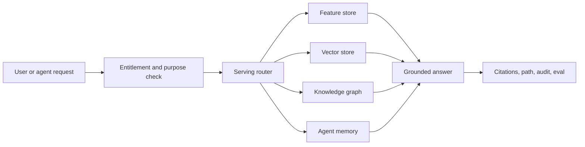
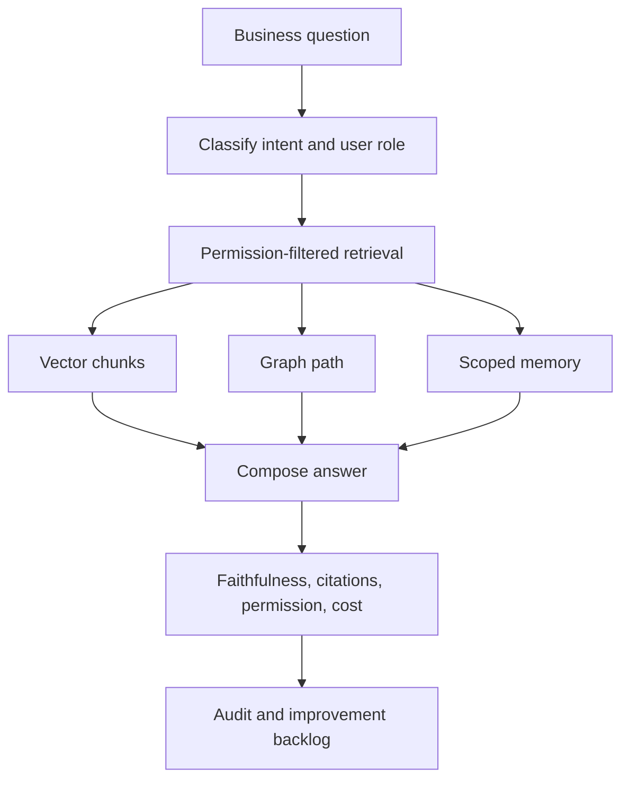
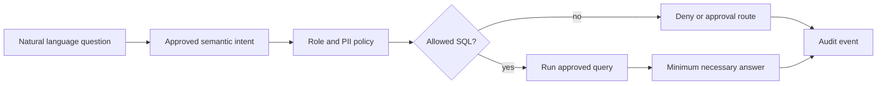
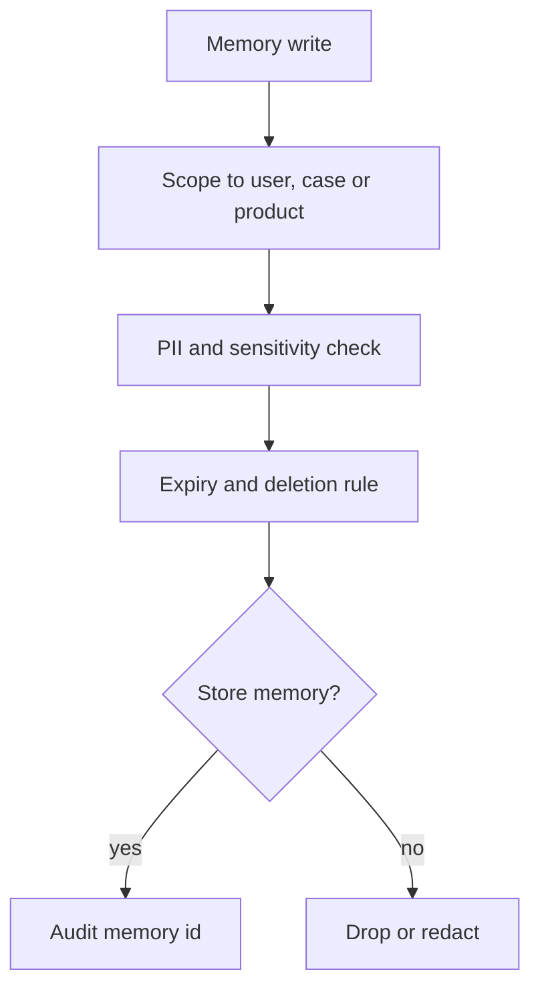
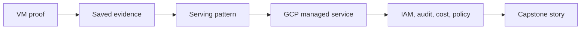

# Day 9 - Data For AI At Scale: Feature Stores, Vector And Knowledge Graphs, Agent Memory - Learner Revision And Study Pack

Share this Markdown with learners after class. It is written for revision, redraw practice and hands-on follow-up. It does not include private lab credentials, tokens, screenshots or access URLs.

## 1. Today In One Paragraph

Today built the **AI-serving layer** over the governed value chain. We moved from "the chatbot answered" to "a governed serving layer answered with permission, citation, graph path, scoped memory, audit and evaluation." The practical thread used insurance claims as the main lane, with healthcare, banking and supply-chain translations for industry practice.

**Memory line:** Retrieval without permission is leakage; memory without expiry is risk.

## 2. Outcomes Covered

By the end of Day 9 you should be able to:

- Explain when to use features, vectors, graphs and memory.
- Build a small governed retrieval path with citation and permission checks.
- Explain why GraphRAG is useful only when relationships matter.
- Create a scoped agent memory rule with expiry.
- Explain text-to-SQL risk and the safer approved-intent pattern.
- Evaluate a RAG answer for citation coverage, faithfulness, permission safety, memory expiry and cost.
- Map the local proof to Vertex AI, BigQuery, Firestore, Secret Manager, audit logs and budget controls.

## 3. Dataset, Tools And Evidence

| Item | What to remember |
| --- | --- |
| Demo lane | `Insurance` |
| Primary dataset | `Insurance/Insurance Claims and Policy Data/Insurance Claims and Policy Data.zip` |
| Fallback | Synthetic insurance claims records in Python |
| Evidence folder | `Persistent_Folder/day-09-evidence` |
| Main artifact | `day-09-vector-graph-memory-eval.md` |
| Main proof script | `day-09-ai-serving-layer.py` |
| Main result | `day-09-serving-layer-results.json` |
| Feature proof | `day-09-feature-serving-table.csv` |
| Grounded answer | `day-09-grounded-answer.md` |
| NL audit proof | `day-09-nl-access-audit.json` |
| Evaluation proof | `day-09-evaluation-report.md` |
| GCP translation | Vertex AI RAG / embeddings, BigQuery vector search, Firestore memory, Secret Manager, Cloud Audit Logs, Cloud Billing budgets |

## 4. Applied Labs Index

| Lab | Time | What you did | Evidence to keep |
| --- | --- | --- | --- |
| Lab 1 | 12:40-13:10 | Created the evidence shell | Markdown artifact saved |
| Lab 2 | 13:10-13:55 | Built local governed serving layer | Python script, JSON, CSV, cited answer |
| Lab 3 | 13:55-14:25 | Tested online vector-store pattern | Qdrant/LanceDB output or fallback note |
| Lab 4 | 16:15-16:50 | Built GraphRAG path | Neo4j Cypher/path or edge-list fallback |
| Lab 5 | 16:50-17:20 | Governed NL access and audit | JSON audit and optional Postgres rows |
| Lab 6 | 17:20-17:50 | Memory, cache and cost controls | Redis TTL/cache output or fallback note |
| Lab 7 | 17:50-18:15 | Evaluation and trust pack | Evaluation report |
| Lab 8 | 18:15-18:40 | GCP translation and industry ship | Translation table and ship statement |

## 5. Practical Steps To Repeat

### Step 1 - Reopen Your Evidence Folder

Use an absolute path. A relative `cd` only works if your terminal happens to be in your home directory:

```bash
cd "${DAY9_EVIDENCE:-$HOME/Persistent_Folder/day-09-evidence}"
pwd
ls -1
```

Expected important files:

```text
day-09-vector-graph-memory-eval.md
day-09-ai-serving-layer.py
day-09-serving-layer-results.json
day-09-feature-serving-table.csv
day-09-grounded-answer.md
day-09-evaluation-report.md
day-09-permission-falsifiability.py
```

### Step 2 - Re-run The Local AI-Serving Layer

```bash
python3 day-09-ai-serving-layer.py
```

Expected shape:

```text
Wrote day-09-serving-layer-results.json
Wrote day-09-feature-serving-table.csv
Wrote day-09-grounded-answer.md
Claims adjuster permission violations: 0
Claims manager citations: POL-101, CLM-9001, PROV-77
Expired memory respected: True
```

### Step 3 - Inspect Permission-Aware Retrieval

Open `day-09-serving-layer-results.json` and check:

- `role`
- `retrieved`
- `citations`
- `active_memory_ids`
- `expired_memory_ids`
- `evaluation.permission_violations`

The most important proof is that restricted content is filtered by role and expired memory is not included.

### Step 3A - Prove The Permission Metric Can Actually Fail

`permission_violations: 0` only means something if you have watched the same check report a violation. Re-run the falsifiability test:

```bash
cp day-09-ai-serving-layer.py day_09_ai_serving_layer.py 2>/dev/null
python3 day-09-permission-falsifiability.py
```

Expected shape:

```text
=== A. Governed path: legitimate roles ===
  claims_manager   citations=3  violations=0
  claims_adjuster  citations=3  violations=0

=== B. Governance bypassed for the SAME role ===
  claims_adjuster served: ['CLM-9001', 'PROV-77', 'POL-101']
  permission_violations = 1

=== C. Role entitled to nothing ===
  external_vendor violations = 3

=== VERDICT ===
  PASS: the metric detects a real leak, so 0 in the governed run means something.
```

Case B is the one to remember: same role, same question, permission filter switched off, and `PROV-77` — the provider-risk chunk a claims adjuster may not see — appears. That is the chunk that would have leaked.

Expected learning: a safety number you have never seen go red is not yet evidence.

### Step 4 - Review GraphRAG Path

Regenerate the path as a file rather than relying on a screenshot. This works with or without Neo4j:

```bash
python3 - <<'PY'
from day_09_ai_serving_layer import graph_path
from pathlib import Path
path = graph_path("C-001", "DISPUTE_SPIKE")
hops = ["C-001"] + [step.split("->")[1] for step in path[1:]]
Path("day-09-graph-path.txt").write_text(" -> ".join(hops) + "\n")
print(" -> ".join(hops))
print("hop_count:", len(hops) - 1)
PY
```

Expected shape:

```text
C-001 -> POL-101 -> CLM-9001 -> P-77 -> DISPUTE_SPIKE
hop_count: 4
```

If Neo4j ran, keep the Cypher output too. The equivalent edge list is:

```text
C-001 -HAS_POLICY-> POL-101
POL-101 -HAS_CLAIM-> CLM-9001
CLM-9001 -USES_PROVIDER-> P-77
P-77 -HAS_RISK_SIGNAL-> DISPUTE_SPIKE
```

Explain why this path is stronger than a plain text answer: it shows the relationship chain. Similarity says two documents are related; the path says *how*, which is what a reviewer has to defend.

### Step 5 - Review Governed NL Access

Re-run:

```bash
python3 day-09-governed-nl-access.py
```

Expected decisions:

```text
meera claim_detail allow approved_semantic_intent
arun customer_email_export deny intent_not_approved
audit claim_risk_by_region allow approved_semantic_intent
```

The key lesson: natural language should map to approved semantic intents, not arbitrary raw SQL.

### Step 6 - Review Memory, Cache And Cost

Safe cache keys should include:

- tenant or workspace
- role or entitlement hash
- question intent
- source version
- permission policy version
- freshness window

Memory must include:

- scope
- owner
- allowed roles
- expiry
- deletion path
- audit trail

### Step 7 - Recreate Evaluation Report

```bash
python3 day-09-evaluation-report.py
```

Blocking failures:

- permission violations greater than zero
- no citations
- expired memory included
- faithfulness check fails
- cost is unbounded or untracked

## 6. Concepts In Simple Words

| Concept | Simple meaning | Proof |
| --- | --- | --- |
| Feature store | Governed serving of structured model features | Feature CSV or online feature lookup |
| Vector store | Embedding index for semantic search | Retrieval result with source ids |
| Knowledge graph | Entities and relationships | Cypher path or edge list |
| GraphRAG | Retrieval that uses both semantic search and graph paths | Answer plus relationship path |
| Agent memory | Stored facts or decisions reused later | Memory id, scope and expiry |
| Permission-aware retrieval | Filter before serving evidence to AI | Denied or filtered result |
| Governed NL access | Natural language mapped to approved intents | Audit row with allow/deny |
| Semantic cache | Reuse safe answers only under same policy context | Redis key with TTL |
| Faithfulness | Answer sticks to provided context | Evaluation row |
| Citation coverage | Answer points to source ids | Citation list |

## 7. Diagrams To Redraw

### AI Serving Layer



Revision prompt: explain which box prevents leakage.

### Governed RAG And GraphRAG Loop



Revision prompt: explain what should happen before the answer is shown.

### Governed NL Access



Revision prompt: explain why direct raw SQL generation is unsafe.

### Memory Safety



Revision prompt: explain why expiry matters.

### VM To GCP Translation



Revision prompt: explain one VM proof and its GCP equivalent.

## 8. GCP Translation Cheat Sheet

| VM proof | GCP managed service | Control before trust |
| --- | --- | --- |
| Python chunk/embed/index proof | Vertex AI RAG Engine or embeddings + vector index | Corpus owner, refresh policy, citation evidence |
| Vector retrieval with metadata filter | BigQuery vector search / vector indexes or Vertex AI Search | Entitlement filter and row/column policy |
| Governed SQL intent | BigQuery authorized views / semantic layer | Approved intents, least privilege, audit logs |
| Memory TTL | Firestore or ADK session/memory service | Scope, expiry, deletion and IAM |
| Secrets not in artifacts | Secret Manager | No tokens in notebooks or shared markdown |
| Access audit | Cloud Audit Logs / BigQuery audit table | Who accessed what, why and when |
| Cost evidence | Cloud Billing budgets and labels | Budget threshold, owner and alerts |

## 9. Production Notes And Pitfalls

- Govern the index before scaling it.
- Do not use GraphRAG unless relationships matter.
- Do not let the model touch raw data.
- Generate SQL only inside approved semantic boundaries.
- Return only what is needed.
- Cache only when the cache key includes permission and source-version context.
- Memory without expiry becomes stale operational risk.
- Evaluation is part of the serving layer, not a post-demo afterthought.

## 10. Industry Use Cases

| Industry | Applied use case |
| --- | --- |
| Healthcare | Clinical knowledge graph over golden entities for multi-hop clinical questions. |
| Banking | Permission-aware serving layer so agents see only the customer's allowed data. |
| Insurance | Claims memory infrastructure over governed claims data. |
| Supply Chain And Logistics | Supplier GraphRAG over supplier, shipment, incident and performance networks. |

## 11. Self-Quiz

| # | Question | Expected answer shape |
| ---: | --- | --- |
| 1 | What is the difference between vector search and GraphRAG? | Vector search finds similar chunks; GraphRAG also explains relationship paths. |
| 2 | Why is permission-aware retrieval non-negotiable? | Retrieval can leak data before the model ever answers. |
| 3 | What should a grounded answer contain? | Citation ids, permission decision, optional graph path, audit and evaluation. |
| 4 | Why is memory expiry required? | Old or sensitive facts should not persist forever. |
| 5 | What blocks release? | Permission violation, missing citation, failed faithfulness, expired memory or unbounded cost. |
| 6 | What is the GCP equivalent of local RAG proof? | Vertex AI RAG/embeddings plus governed storage/search/audit/cost controls. |

## 12. Homework Before Day 10

Spend 30 minutes improving your Day 9 artifact:

1. Add one clearer cited answer.
2. Add one stronger permission-denied example.
3. Add one graph path or redraw the fallback graph.
4. Add one memory expiry and deletion rule.
5. Add one evaluation metric with result.
6. Add one capstone line: how this serving layer supports your final project.

## 13. Shareable Checklist

- [ ] My artifact is saved in `Persistent_Folder/day-09-evidence`.
- [ ] My artifact names the lane and dataset or fallback.
- [ ] My Python serving proof ran or the blocker is recorded.
- [ ] I have one cited grounded answer.
- [ ] I have one permission decision.
- [ ] I have one graph path or fallback edge list.
- [ ] I have one memory expiry rule.
- [ ] I have one audit or cache/cost proof.
- [ ] I have one evaluation table.
- [ ] I have a GCP translation table.
- [ ] I have no tokens, passwords, private URLs or credentials in the artifact.

## 14. Further Study Links

Use these for follow-up reading. Prefer official documentation when tool behavior matters.

- [Feast documentation](https://docs.feast.dev/)
- [Qdrant filtering documentation](https://qdrant.tech/documentation/concepts/filtering/)
- [LanceDB Python documentation](https://lancedb.github.io/lancedb/python/python/)
- [Neo4j GraphRAG documentation](https://neo4j.com/docs/neo4j-graphrag-python/current/)
- [BigQuery vector search](https://cloud.google.com/bigquery/docs/vector-search)
- [BigQuery vector indexes](https://cloud.google.com/bigquery/docs/vector-index)
- [Vertex AI RAG Engine](https://cloud.google.com/vertex-ai/generative-ai/docs/rag-overview)
- [Agent Development Kit memory](https://google.github.io/adk-docs/sessions/memory/)
- [Ragas metrics](https://docs.ragas.io/en/latest/concepts/metrics/available_metrics/)
- [Secret Manager overview](https://cloud.google.com/secret-manager/docs/overview)
